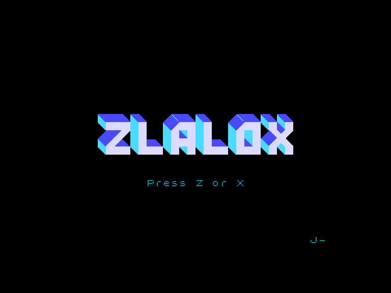
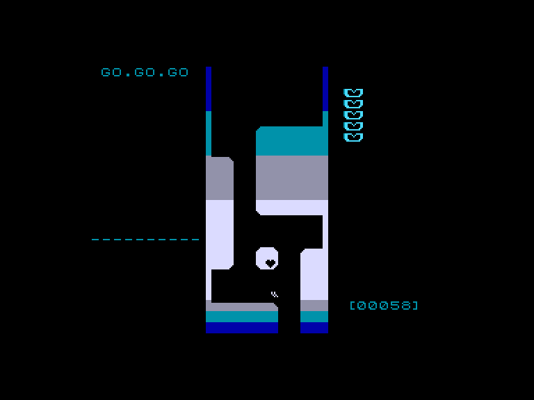
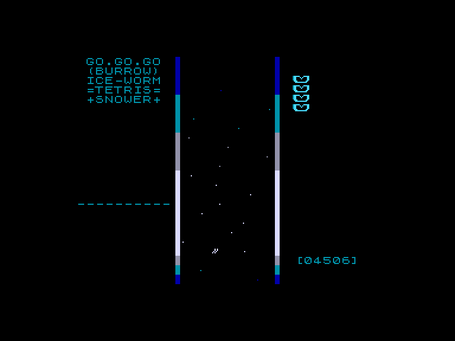
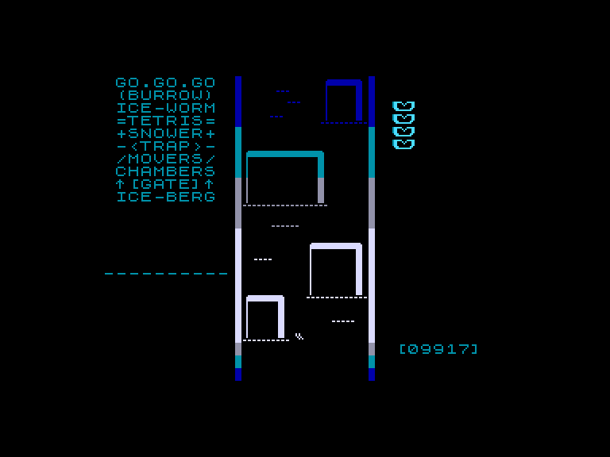

# ZlaloX

 
 
 

Жанр: аркада  
Кількість гравців: 1  
Мова гри: англійська  

## Емуляція
### SPEmu / SPEmu128
❌не працює  
### SP2
➕ працює

## Опис

У цій грі ви берете участь у швидкісній гонці зі слалому. Ваше завдання — пройти трасу, уникаючи перешкод, рухаючись лише ліворуч або праворуч. Ви не можете ні прискоритися, ні сповільнитися — має значення тільки те, чи зможете ви дістатися до фінішу.

Правила прості, але чи зможете ви пройти гру до кінця?

## Системні вимоги

### Мінімальні системні вимоги
Оперативна пам'ять: **128 КБ**

## Керування та тонкощі запуску

### Основні [елементи керування](../controllers.md):
⌨ Клавіатура (`Z`, `X`)  

## Посилання

📃 [Spectrum Computing](https://spectrumcomputing.co.uk/entry/43295/ZX-Spectrum/Zlalox)  
🏡 [Домашня сторінка гри](https://snauts.itch.io/zlalox)  

## Автори

🖥 Платформа: [ZX Spectrum](https://spectrumcomputing.co.uk/entry/43295/ZX-Spectrum/Zlalox)  
👨‍💻 Програмісти: Snauts  
📅 Рік релізу: 2024  