# Enterprise 64 (Enterprise Sixty Four) / Enterprise 128 (Enterprise One Two Eight)

Країна походження: Англія  
Компанія-виробник: [Enterprise Computers Ltd](companies/enterprise-computers-ltd.md)  

Початок продаж:

- 64К — 14 грудня 1984
- 128К — 16 травня 1985
- 128К — 19 травня 1987 (в Угорщині)

## Технічні характеристики  

Процесор: Zilog Z80A (4 MHz)  
Максимальний керований розмір пам'яті (ОЗП+ПЗП): 3,968 МБ (256 сегментів по 16 кілобайт)  
Оперативна пам'ять: від 64 КБ / 128 КБ  
ПЗП мат. плати: 32 КБ (макс. 64 КБ)  
ПЗП картриджу: 16-64 КБ  
Сопроцесори: [Nick](hardware/hm-nick.md) (відео) та [Dave](hardware/hm-dave.md) (аудіо, робота з пам'яттю та портами)  
  
### Графічні можливості відеочіпу NICK

- Відеопам'ять до 64 КБ (за рахунок ОЗП з незалежною адресацією)
- Загальна палітра кольорів - [256](programming/system-info/info_colour-palette.md)
- Можливість задавати довільний відеорежим та розміщення у пам'яті для кожного рядку пікселів (завдяки чому можна легко сконфігурувати екранну пам'ять схожу на екрани комп'ютерів ZX Spectrum, Amstrad CPC та інших з аналогічними відеорежимами).
- Апаратний текстовий режим.
- Апаратна вертикальна прокрутка.
- 4-бітний цифровий відеовхід.
- 2- 4- 16- та 256-колірний графічний режим (колір на піксель)
- 16-колірний "атрибутний" графічний режим (2 кольори на блок 8х1)
- 40-символьний апаратний текстовий режим (2 пари кольорів)
- 80-символьний програмний текстовий режим (4 пари кольорів)
- Підтримка 64-, 128- та 256-символьних шрифтів. (128 - за замовчуванням)

Якщо з графічними режимами на 2, 4 та 256 кольорів все доволі просто, з 16-колірним все складніше. Палітра на 16 кольорів складається з двох частин: якщо 8 перших кольорів можна призначати будь-які, то 8 кольорів другої половини вибираються з 32-х фіксованих наборів (BIAS). Саме через це кольори у конверсіях ігор з ZX Spectrum чи Amstrad CPC будуть відрізнятись від оригінальних. Щоб простіше це зрозуміти можна скористатись [таблицею підбору кольорів](http://ep.lgb.hu/colors.html).  
  
Приклади апаратних можливостей графічного процесора:

 
 
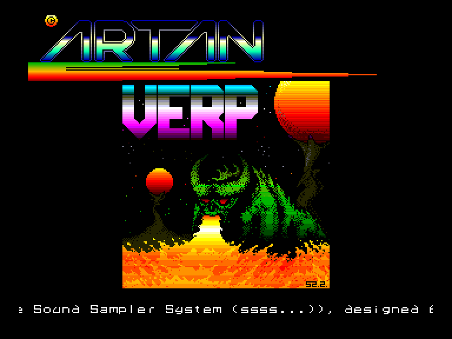 
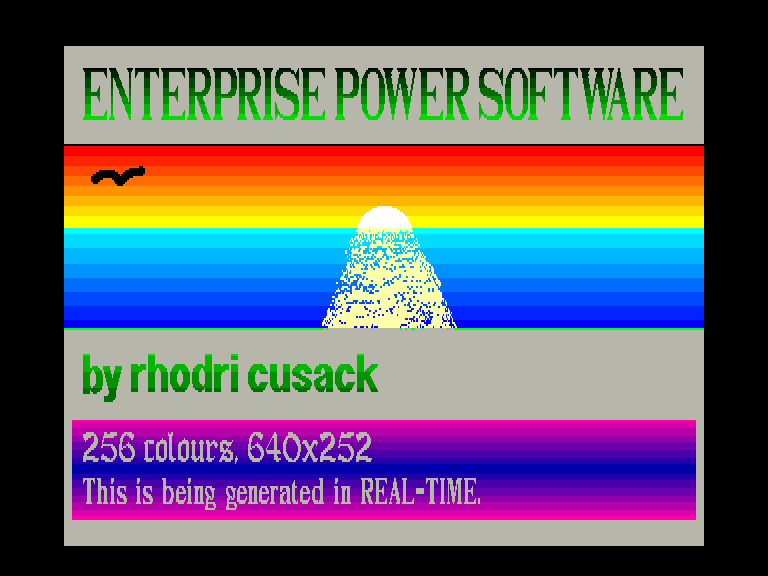 
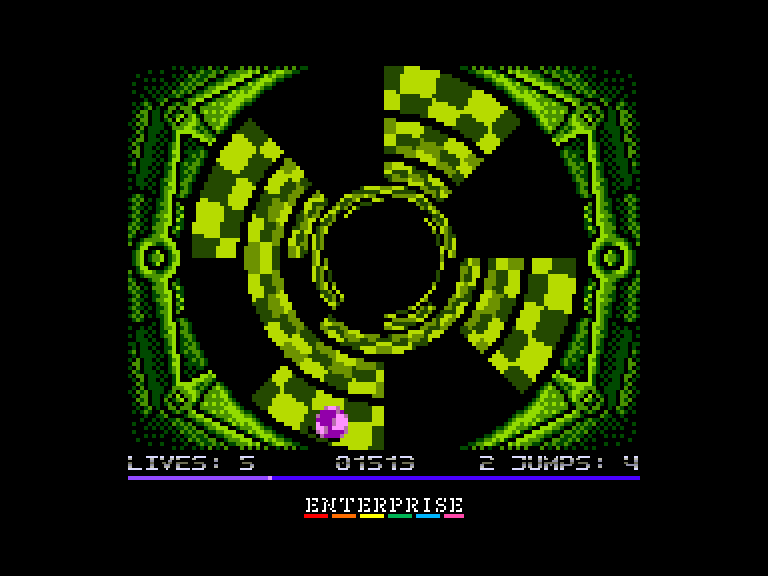 
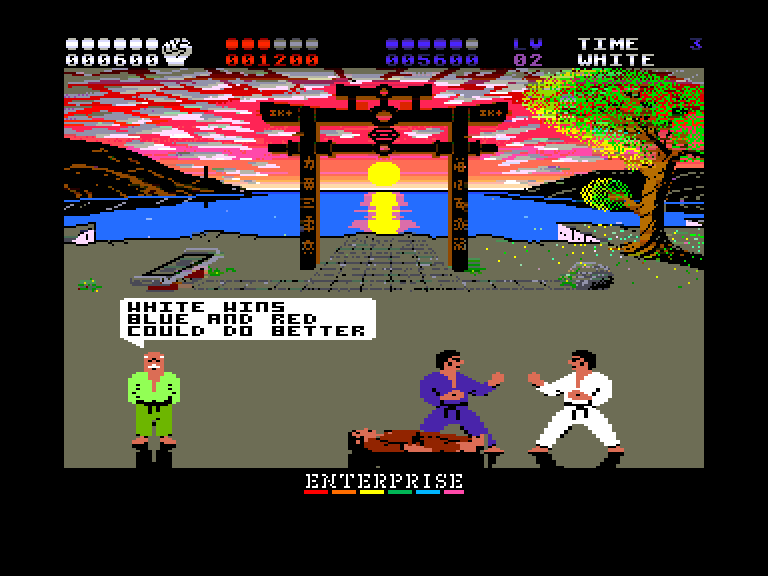 
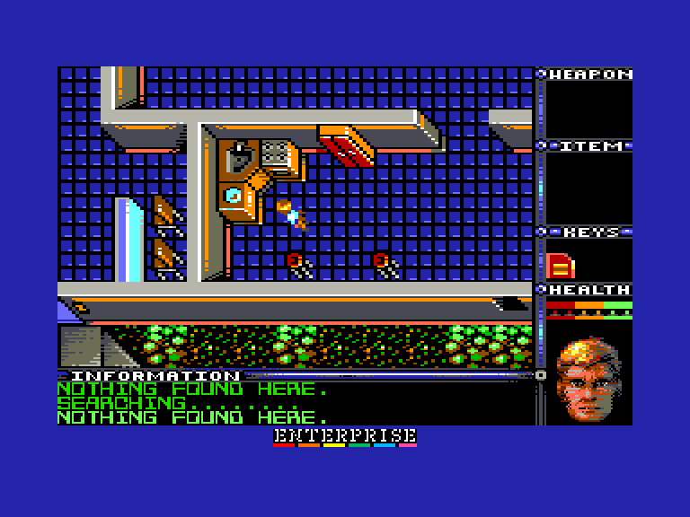 
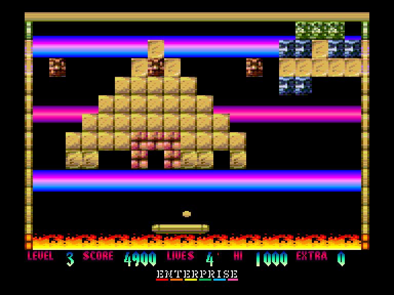 

**_Максимальна роздільна здатність екрана по горизонталі_**  
736 пікселів - 2 колірний режим  
368 пікселів - 4 колірний режим або 16 колірний атрибутний режим (8-піксельні блоки по 2 кольори)  
184 пікселя - 16 колірний режим  
92 пікселя - 256 колірний режим  
46 символів - апаратний текстовий режим  
92 символів - програмний текстовий режим  
  
**_Максимальна роздільна здатність екрана по вертикалі_**  
288 пікселів у звичайному режимі  
576 пікселів у інтерлейсному.  
32 символа текстового режиму.  

(у офіційній документації можна побачити дещо менші цифри, але там вказані параметри відеорежимів які можна створити використовуючи лише системні виклики операційної системи).

### Характеристики звукового чипу DAVE

3 звукові + 1 шумовий канал (8 октав, стерео).  
Доступні ефекти включають дісторшн, фільтри низьких і високих частот, а також кільцеву модуляцію.  
По характеристикам схожий на розповсюджений AY, але має деякі відмінності.  
  
### Інтерфейсні роз'єми

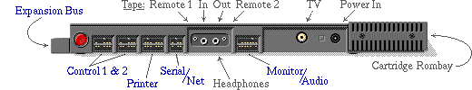

- Порт системної шини для підключення додаткових карт для розширення апаратних можливостей (такі як дисковий контролер, апаратний емулятор Спектруму та багато інших).  
- RGB-відеовихід із стерео аудіо (та монохромний композитний сигнал)  
- RF-відеовихід  
- Два роз'єми для керування касетними накопичувачами.  
- Аудіо вхід та вихід (стерео) для підключення касетних накопичувачів, навушників або аудіосистем.  
- Послідовний порт RS-423 (об'єднаний з мережевим портом)  
- Паралельний порт Centronics  
- Два порти для підключення зовнішніх Atari-сумісних джойстиків (до 6 штук.) або інших пристроїв введення.  
- Порт для ПЗП-картриджів  
  
### Конфігурації комп'ютера

Немодифіковані комп'ютери поділяють на 2 моделі: 64К та 128К за обсягом оперативної пам'яті. В стандартній шістдесятчетвірці, окрім меншого об'єму ОЗП, прошиті старіші версії [EXOS](software/ss-exos.md) та [IS-Basic](programming/is-basic.md). Для неї значно (15%) менший обсяг програмного забезпечення, і чип [Nick](hardware/hm-nick.md) нерідко встановлений ранньої ревізії (при нагріві з'являються деякі графічні артефакти на екрані). Але, не зважаючи на це, з неї цілком можливо зробити "повноцінний" Ентерпрайз: прошивки ПЗ доволі легко оновлюються, а для модулів розширення оперативної пам'яті у вільному доступі є схеми для самостійного виготовлення.  
*(якщо точніше: 128-ка це та ж 64-ка тільки з додатковою оперативкою та новішою прошивкою)*
  
128К-моделі можуть бути у двох варіантах: з англійською клавіатурою, та німецькою, що впливає і на [локалізацію ПЗ](software/ss-localizations.md). В німецькій моделі мову інтерфейсу можна програмно переключити на англійську і навпаки.  
  
Є і інші модифікації комп'ютера, але вони особливо нічим не відрізняються від описаних вище.

# Програмне забезпечення

## EXOS

[EXOS](software/ss-exos.md) (Enterprise eXtendable Operation System) - це основна операційна система для комп'ютера Enterprise, що записана у внутрішнє ПЗП комп'ютера, і під час його ввімкнення бере керування на себе. Вона відповідає за визначення поточної конфігурації, інвентаризацію доступної пам'яті, обслуговування вимог до пам'яті різних системних пристроїв і користувацьких програм, ведення обліку зайнятих/вільних областей пам'яті. Прямо як у сучасних операційних системах! Наприклад, можна завантажити у пам'ять одночасно декілька програм (такі як монітори, компілятори чи редактори), а потім запускати їх по потребі. В стокових машинах прошита EXOS у [версіях](software/exos/exos-versions.md) 2.0 та 2.1, але у наявності є неофіційна версія 2.4, з новими можливостями та виправленнями помилок офіційних версій, яка може бути встановлена досить просто.  
  
### EXOS-сумісне програмне забезпечення

Вважаючи на те що конфігурацій комп'ютера може бути досить багато, то розробляти програмне забезпечення дуже рекомендується з використанням функцій EXOS. Тобто не використовувати звичну практику програмування в стилі «POKE-PEEK» для Спектрум-сумісних машин, де розміщення даних у пам'яті знаходиться у жорстко визначених місцях.  
  
[EXOS-сумісні](software/exos/exos-compability.md) програми баз проблем будуть працювати на будь-якій придатній конфігурації комп'ютера.

## IS-Basic

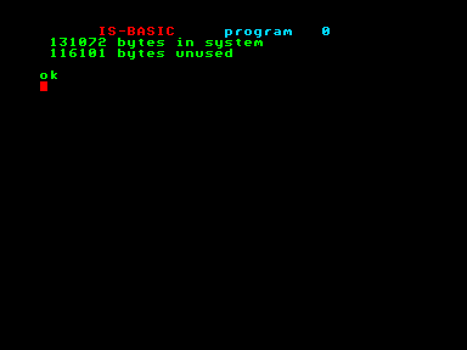

У стандартну комплектацію до комп'ютера входить картридж з [IS-Basic](programming/is-basic.md). Ця мова програмування сягає далеко за межі діалектів Бейсиків тогочасних 8-бітних комп'ютерів. Її головні особливості:

 - повноцінна підтримка структурного програмування;
 - безпосередній доступ з IS-BASIC до (майже) всіх сервісів операційної системи EXOS, тобто наявність повноцінних інструкцій та команд для роботи з графікою, звуком та мережею;
 - незвично розвинена для BASIC обробка помилок та виняткових ситуацій;
 - одночасне керування кількома програмами в пам'яті, які можуть викликати одна одну.

За своєю суттю IS-BASIC є такою собі "гібридною мовою" — поєднанням Basic, Pascal та Logo. Більшість програм на Паскалі можна переписати на IS-BASIC майже "дослівно".

Одним з недоліків цього інтерпретатора є низька швидкість. У багатьох Basic-бенчмарках відразу було помітно суттєве відставання від Бейсиків на інших платформах, але в той же час точність прорахунків чисел із плаваючою комою була вищою.

## EXDOS

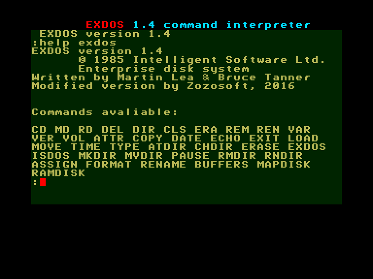

[Дискова операційна система](software/ss-exdos.md) що розміщена у ПЗП [контролера дисків](hardware/hd-exdos.md) і дозволяє працювати з носіями інформації з довільним доступом до даних і файловою системою FAT-12. Для роботи з файлами надає свою оболонку, або за допомогою EXOS може виконувати команди з інших програм.

## IS-DOS

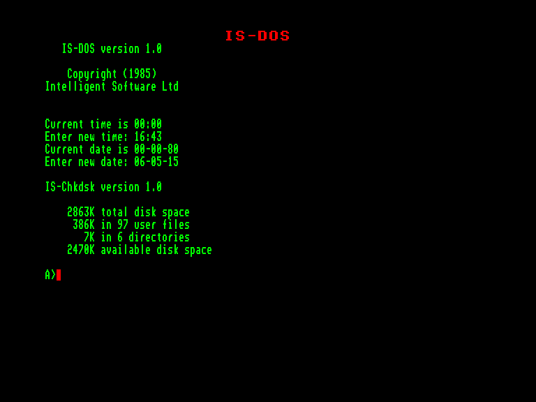

[Операційна система](software/ss-is-dos.md) яка дозволяє запускати на Enterprise програми написані для CP/M-80 (до версії 2.2). Як і EXDOS, IS-DOS використовує файлову систему FAT-12, і тому файли цих двох систем можуть одночасно зберігатися на одному диску. Є версії що завантажуються з диску, а є і версії для ПЗП, що дозволяє швидко переключитись у потрібне середовище з інших програм.  
Для використання IS-DOS необхідна EXDOS встановлена у системі.  
Сумісний тип терміналу: VT-52.

## SymbOS

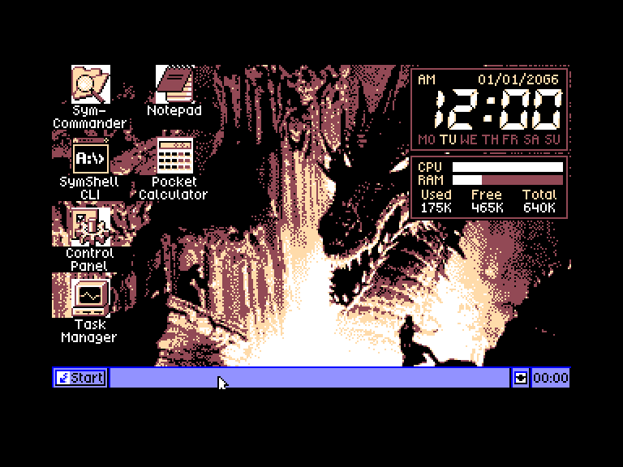

[Сучасна багатозадачна операційна система](software/ss-symbos.md) з графічним віконним інтефейсом схожим на класичний стиль Windows 9x.  
Домашній сайт: [http://www.symbos.de](http://www.symbos.de/)  

Хоч ця система і запуститься на комп'ютері з 128КБ оперативної пам'яті, але для повноцінного використання необхідно хоча би ще додаткових 64 кілобайт.  

# Додаткове апаратне забезпечення  

## Дисковий контролер EXDOS

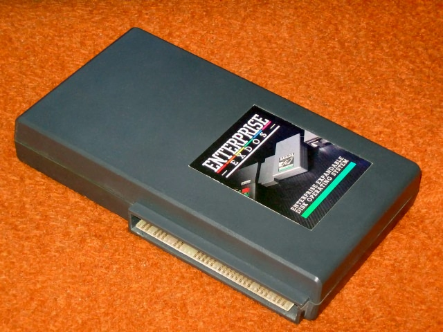 
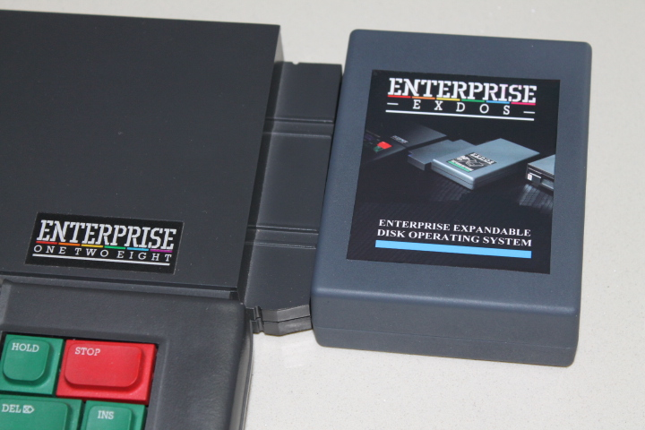 
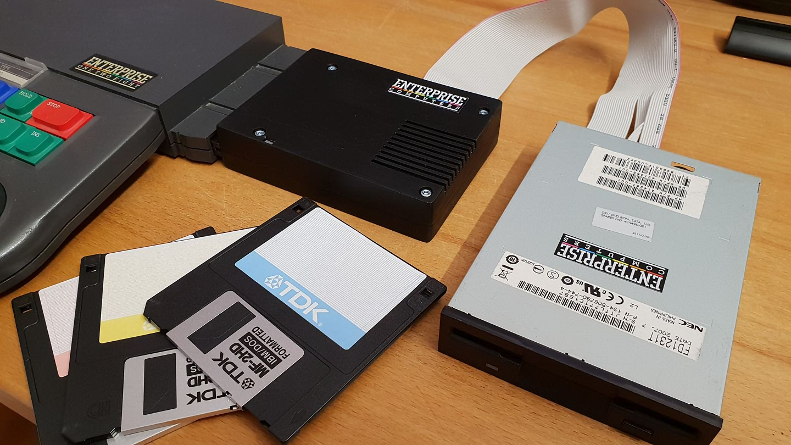 
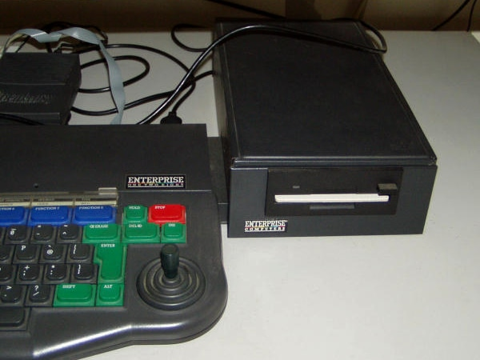 
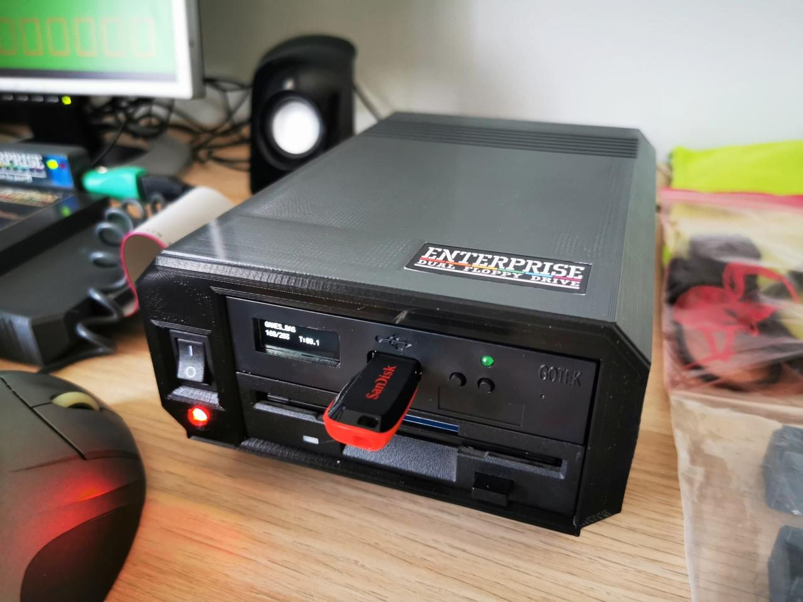 
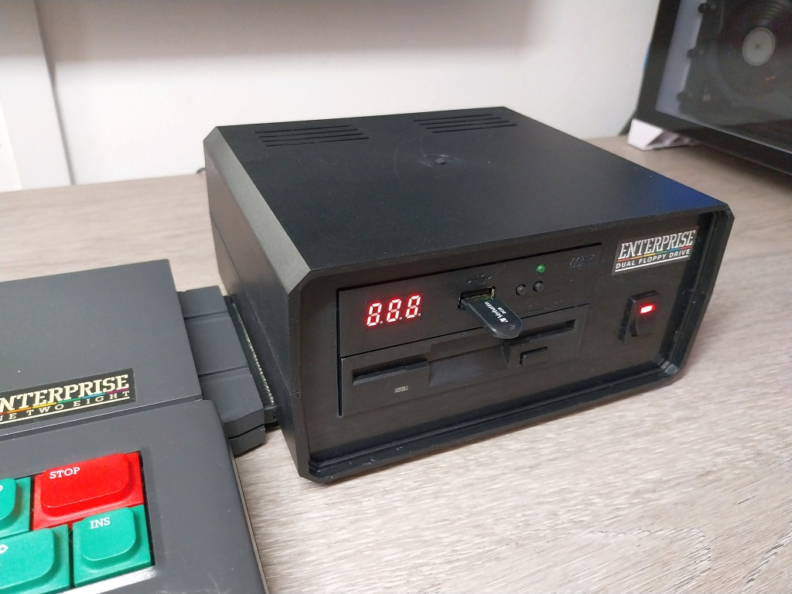 

У стандартному виконанні контролер дозволяє підключати до 4-х накопичувачів гнучких дисків і працювати з дискетами формату 3½" та 5¼":  

- односторонні; 40 доріжок: 180К  
- односторонні; 80 доріжок: 360К  
- двосторонні; 40 доріжок: 360К  
- двосторонні; 80 доріжок: 720К  
  
Розігнані комп'ютери можуть працювати і з дискетами HD-формату.  

[EXDOS-контролери](hardware/hd-exdos.md) можуть бути окремому виконанні, або суміщені у одному корпусі з дисководом та блоком живлення.  
  
В даний момент знайти у продажі оригінальні або неофіційні плати контролерів досить важко, але їх можна виготовити самотужки.

## Адаптер SD-карт

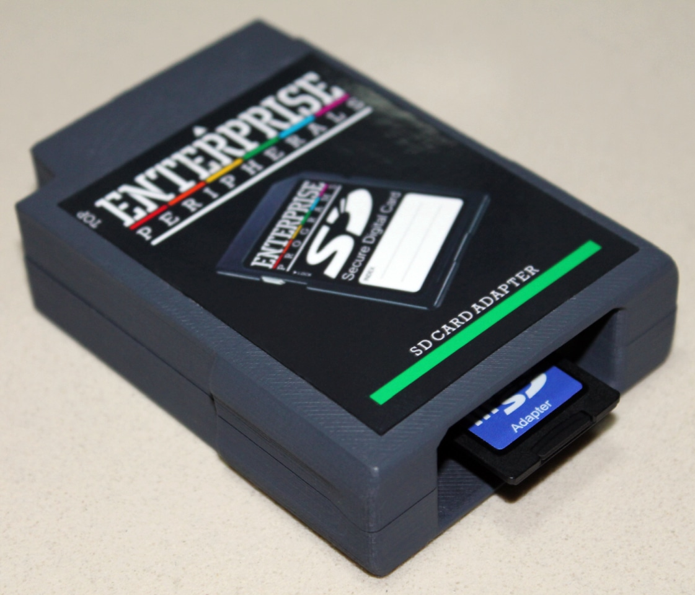

[Адаптер](hardware/hd-sd-card-adapter.md) дозволяє використовувати SD-карти у якості носія інформації. На карточці створюється один або декілька розділів з файловою системою FAT-12 (максимальний розмір 32 МБ). В останніх версіях адаптер містить годинник реального часу (RTC).  
 
  
## Мережевий адаптер EPNET

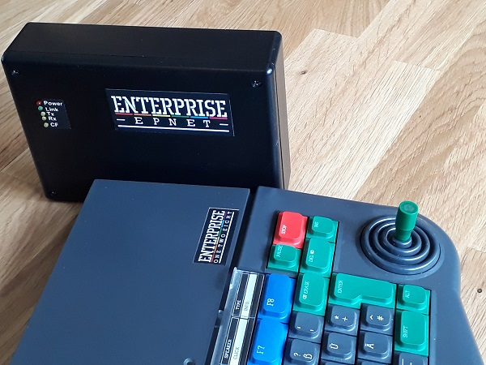

[Карточка для підключення до Ethernet-мережі](hardware/net/hn-epnet.md).  

## Адаптери та перехідники для інтерфейсних портів

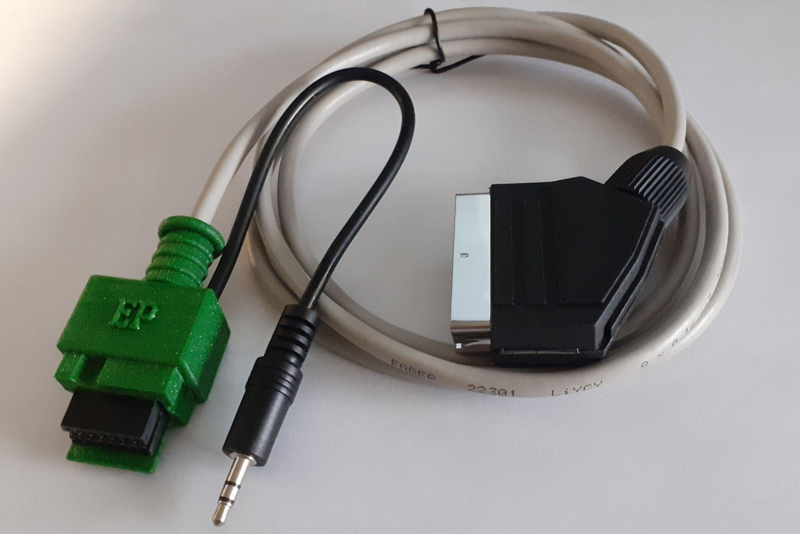

Через те що майже усі порти мають вигляд звичайних крайових роз'ємів для їх використання потрібні спеціальні кабелі або перехідники. Їх можна як [зробити самотужки](http://enterprise.iko.hu/pinouts.htm) так і [придбати вже готові](https://enterprise128.hu/hu/online-ep-piacter).  

## EnterMice

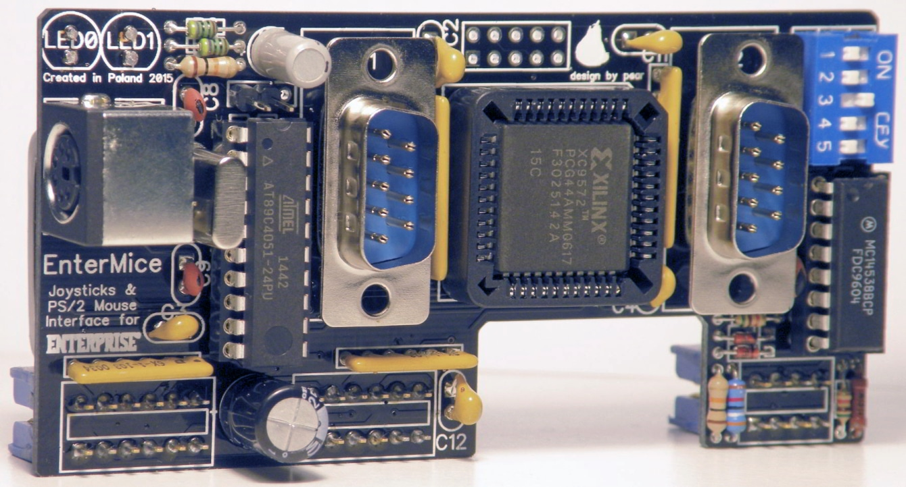

[Адаптер](hardware/hid/mouse-entermice.md) для підключення миші та джойстиків.  
Дозволяє підключати PS/2 миші та Atari-сумісні джойстики.  
  
## Багатофункціональні карти  

Успішно підключали до Ентерпрайзу і карти що були розроблені для інших платформ (MSX та Amstrad CPC) такі як [Symbiface 3](hardware/he-sf3.md), [RSF3](hardware/he-rsf3.md), [SE-One](https://www.cpcwiki.eu/imgs/4/45/SEONE_MANUAL%28beta%29.pdf).

# Апаратні модифікації  

## Внутрішнє розширення ОЗП

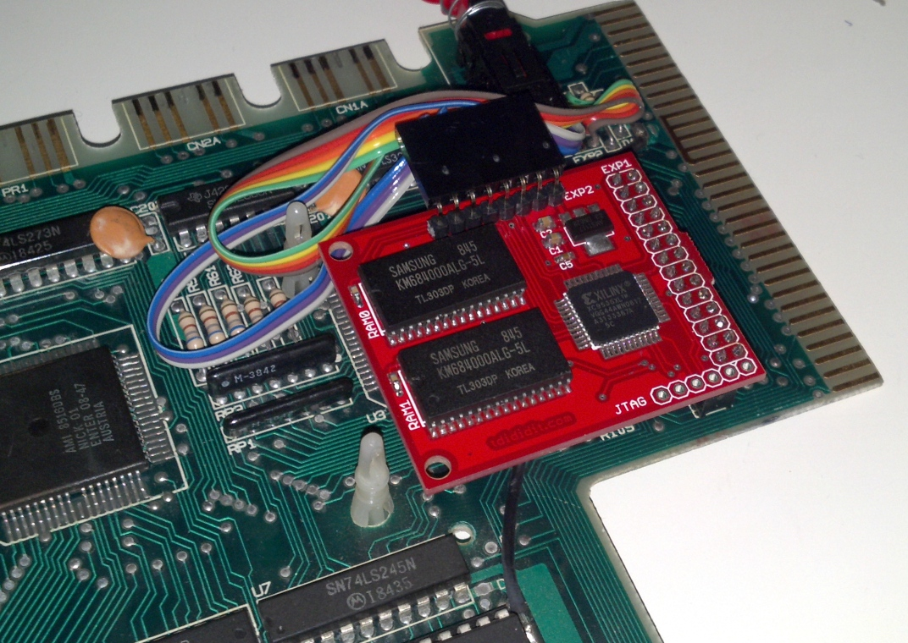

Однією з поширених модифікацій є [розширення оперативної пам'яті](hardware/ram-expansion/int-ram-exp.md). Завдяки чому з'являється можливість запуска деяких ігор (або розширення їх функціоналу), повноцінна робота [SymbOS](software/ss-symbos.md) та інші мультимедійні можливості. У більшості випадків буде достатньо додаткових 512 КБ, але є модулі і для додаткових 1,5 МБ (та більше).  
На деякі модулі схеми відкриті, тому їх можна виготовити самостійно.

## Розгін

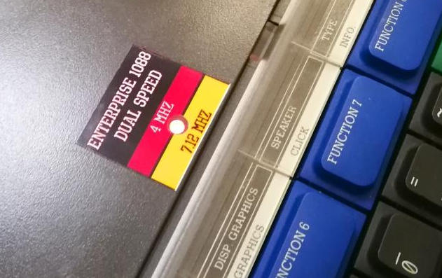

Для збільшення швидкодії комп'ютера користувачі інколи вдавались до розгону з **4** МГц, до **6**, **7.12** та **10** МГц. Завдяки чому з'являлась можливість працювати з гнучкими дисками HD-формату, та кращим функціоналом у деяких програмах та іграх (наприклад, MOD-player видає чистіший звук). Розгін можна зробити як [самотужки](http://enterprise.iko.hu/magazines/Enterpress_2016_UK.pdf#page=10), так і за допомогою спеціального модуля [miniTurbo](hardware/mods/miniturbo.md).
  
## Схема живлення (EPower / REpower)

Модулі [EPower](hardware/mods/epower.md) та [REpower](hardware/mods/repower.md) створені для заміни оригінальної електронної схеми живлення на сучасну - економнішу, стабільнішу та значно холоднішу (після чого можна забути про гарячий радіатор охолодження). Розроблені саме так, щоб їх можна було встановити на місце старих компонентів.  
  
## Заміна котушки індуктивності L2

В деяких комп'ютерах причиною нестабільного зображення була котушка індуктивності L2. Так як її заміну зробити важко, був розроблений модуль [The L2](hardware/mods/the-l2.md), який вирішував цю проблему. Цей модуль був інтегрований у [miniTurbo](hardware/mods/miniturbo.md).
  
## Вимикач вбудованого динаміка

Користувачі комп'ютера коли підключали до нього аудіосистему (або навушники) з'ясовували, що внутрішній динамік не так то і просто вимкнути. Можна зробити це програмно, але після завантаження більшості програм чи ігор це налаштування скидається на значення по замовчуванню, і динамік знову починає працювати. Тому його або просто від'єднували, або ставили механічний вимикач десь у непримітному місці.

# Ігрові програми  
  
У зв'язку з тим що Ентерпрайз спіткав невдачу на ринку домашніх мікрокомп'ютерів офіційних релізів ігор було не так вже й багато (порівняно з іншими платформами). Багато з них були примітивними Бейсік-програмами чи прямими портами з ZX Spectrum та Amstrad CPC, які не відображали усі можливості апаратної платформи. Тому переважна кількість ігор являють собою неофіційні конверсії зі Спектруму нерідко жахливої якості. Були і самостійні розробки на території Угорщини, але геймплей і зовнішній вигляд в них був доволі примітивний.  
  
## XX сторіччя  
Найбільш цікаві проекти минулого сторіччя, що я можу порекомендувати для розгляду, наступні:  
  
**Raid** (**Raid over Moscow**) [YT](https://youtu.be/wCkr9Q4ATrI), **Beach Head** [YT](https://youtu.be/0qlBdPCVqQE), **Starstrike 3D** [YT](https://www.youtube.com/watch?v=fzgrmOVv1eg), **Nodes of Yesod** [YT](https://www.youtube.com/watch?v=v9Po7Fg_wnM) хоч і були візуально такі самі як і на платформі від Сінклера, але звукові ефекти замість простенького "пук-пук" стали значно багатшими та із стереоефектами.  
  
Порти з Amstrad CPC але з дещо покращеною музикою:

- **Jammin'** [YT](https://youtu.be/dUb04FxKuz8) - музична гра з простеньким геймплеєм. Має деякі відмінності від версії для CPC.
- **Race-Ace** [YT](https://www.youtube.com/watch?v=ahlVVSs2b7s) - один з перших симуляторів перегонів.
- **Sorcery** [YT](https://youtu.be/8ggu8Q-24Lw) - однозначний хіт як на Ентерпрайзі так і на Амстраді. Гра отримала розширену версію яку вже в наші часи теж перенесли на Ентерпрайз.
- **Cauldron** [YT](https://youtu.be/KURvWzC8uRo) - гра має чудову музику та графіку, але геймплей досить хардкорний. Гру важко пройти навіть з нескінченною кількістю життя. [Автор конверсії](peoples/pers_john-brandwood.md) так і не отримав ніякої оплати за роботу (він навіть не здогадувався що гра взагалі продавалась).
- **Turbo-Rudi** [YT](https://www.youtube.com/watch?v=ljHolnNBhFk) - чудова аркадна гра. Оригінальні назви її **Electro Freddy** та **Uncle Claude**. А от щодо офіційності релізу цієї гри в мене великі сумніви.

Те саме можна сказати і про наступні ігри **Permolift** (вона ж **Elevator Action**) [YT](https://youtu.be/op3AFiaiZbg), **Tutti Frutti** (вона ж **Fruity Frank**) [YT](https://youtu.be/RVsIMRLbR3Y) та інші, які продавались угорськими компаніями під іншими назвами.  
  
Із дійсно ексклюзивних проектів можу порекомендувати:  

- **Out of This World** [YT](https://youtu.be/O1S03qZLLio) - непогана гра, але з дещо важкуватим геймплеєм.
- **EnterBall** [YT](https://www.youtube.com/watch?v=ylI0MVhBF4s) - клон Арканоіда.
- **Unicum** [YT](https://www.youtube.com/watch?v=Cekk4JLN5Z4) - клон гри **Flasch Bier**, але з угорським колоритом ([Unicum](https://uk.wikipedia.org/wiki/%D0%A3%D0%BD%D1%96%D0%BA%D1%83%D0%BC) - традиційний угорський біттер).
- **Diamonds** [YT](https://youtu.be/w6S3-q6LCe8) - непоганий клон Діггера.
- **Dot Collector** [YT](https://youtu.be/5Gej81s40po) - доволі проста гра, яка нагадує PacMan, але має дещо інший геймплей. Це перша гра яку я побачив на Ентерпрайзі, і вона завжди залишиться в моєму серці.
- **GridTrouble** [YT](https://youtu.be/8YCIYo7pJQA) - Гра у жанрі Amidar (треба зафарбовувати клітинки оббігаючи їх з усіх сторін). На перший погляд, гра дуже важка, але попрактикувавшись в неї можна грати, хоч на мій погляд просто нереально пройти усі 32 рівня маючи всього 3 спроби. Гра пізніше отримала "ремастер" для DOS під назвою [DotTrouble](https://youtu.be/WnV6qeR4qI4).
- **Pasziansz** [YT](https://www.youtube.com/watch?v=gmiJAzX_8OI) - набір з 4-х пасьянсів з підтримкою миші.
- **Turbo Amoeba** [YT](https://www.youtube.com/watch?v=Td3z6pIT1W4) - гра 5-в-ряд.
- **SWAP** [YT](https://www.youtube.com/watch?v=XeU5zVaLufg) та **Logiball** - логічні ігри.

Одним з креативних творців (він і досі працює у сучасному геймдеві) був [Endy](peoples/community/endy.md) ([ORK Soft](http://www.ep128.hu/Ep_Games/Orksoft.htm)), який створив багато самобутніх речей і не боявся експериментувати. В більшості випадків це були текстові адвенчури на угорській мові з гарними екранами, але є і ігри які не потребують знання угорської: [PacMan City](https://www.youtube.com/watch?v=7o1FRxW_Y3s), **Pacman City 2**, [TNT](https://www.youtube.com/watch?v=TZNVgXYcwsw). Ось ще приклади його ігор: [Book of Life](http://www.ep128.hu/Ep_Games/Pic/Book_of_Life.gif) та [Mutant Test](https://www.youtube.com/watch?v=B0XesECX5HA)  
  
Інші ігри, які можна лише глянути: [Tombs of Doom](https://youtu.be/OXtZEnOI2Vw), **Super Pipeline II**, [Bulldozer](https://youtu.be/9zU7RjULJJo), [R2D2](https://youtu.be/iFxxl7Y68qQ), [Mirror World](https://www.youtube.com/watch?v=tln82A5d_r8), [Eggs of Death](https://www.youtube.com/watch?v=N9C0ao_f1_g).  
  
А є і такі які викликають лише фрустрацію через нереальну складність: [Abyss](https://youtu.be/B-dlyyltjNo), [Airwolf](https://www.youtube.com/watch?v=lE9c4rWqq7E), [Devil's Lair](https://youtu.be/ed0st5KKnX0), [Jack's House of Cards](https://youtu.be/G1Xp-xgFl2U), [The Lands of Havoc](https://www.youtube.com/watch?v=XCuCq5jde2M).  
  
## XXI сторіччя  
  
Після 2005 року, коли ком'юніті створило осередок на форумі enterpriseforever, були написані нормальні емулятори і ентузіасти ознайомились з іграми на сусідніх платформах, почали з'являтись конверсії ігор нормальної якості (а інколи і з візуальними покращеннями) з ZX Spectrum, Amstrad CPC, Commodore 16 Plus/4, аркадних автоматів, Atari (8-bit), Spectrum Next та інших.  
  
Зазвичай це багатоколірні тайтли які могли б отримати офіційні релізи ще у 80-х: [Exolon](https://www.youtube.com/watch?v=WuA-syNkmJo), [Nebulus](https://youtu.be/4h9maFWsC48), [Prince of Persia](https://www.youtube.com/watch?v=1WRPB7RdL5Y), **La Abadia Del Crimen**, [Alien 8](https://youtu.be/Qq-DjhiOXog), **ATF**, [Barbarian](https://youtu.be/I0WMQzVFRuI), **Cybernoid 1** та **2**, **Boulder Dash**, **Castle Master 1** та **2**, [Chase H.Q.](https://www.youtube.com/watch?v=WXCk-lGaKbM), **Commando**, [Crazy Cars 1](https://www.youtube.com/watch?v=DzcEC5XSijY) та **2**, **Dark Side**, **Deflector**, **Dizzy 7**, **Driller**, [Green Beret](https://www.youtube.com/watch?v=Aiy_9Mz--5M), [H.E.R.O.](https://youtu.be/a9G5b2YzAc0), **Head over Heels**, **Heartland**, **Hydrofool**, **Ikari Warriors**, **Impossible Mission 1** та **2**, [Inside Outing](https://www.youtube.com/watch?v=jwTae4lC-i0), [International Karate Plus](https://www.youtube.com/watch?v=KvTHOaR0E9w), [Krakout](https://www.youtube.com/watch?v=Lb0shkDJfAk), **Microprose Soccer**, [Nigel Mansell's Grand Prix](https://www.youtube.com/watch?v=6GIzqTJhQPE), [North & South](https://www.youtube.com/watch?v=5lP7Y0lKqAk), [North Star](https://www.youtube.com/watch?v=UNDmFsijbCE), [Raster Runner](https://youtu.be/xp3EMdsBDXg), [Rick Dangerous 1](https://youtu.be/epSvMDbLo00) та [2](https://youtu.be/MtEijEMLBlE), [Short Circuit](https://www.youtube.com/watch?v=eB_835CwlSA), [SwitchBlade](https://www.youtube.com/watch?v=W7X4H6xJV2o), [WEC le Mans](https://www.youtube.com/watch?v=BPULrPCMsCM) та інших.  
  
Але і сучасні ігри теж переносять на Ентерпрайз.  
Портовані були майже усі ігри команди 4MHz: [Adios a la Casta 1](https://www.youtube.com/watch?v=Ozpdf_p5zgg) та [2](https://www.youtube.com/watch?v=atNI0AMza8k), [El Tesoro Perdido de Cuauhtemoc](https://www.youtube.com/watch?v=3KOkTQU0qhY), **Profanation 2. Escape from Abu Simbel**, [Operation Alexandra](https://www.youtube.com/watch?v=V8TfVLIrxDo) які є доволі чудовими.  
  
Bибрані тайтли RetroWorks: [The Sword of Ianna](https://www.youtube.com/watch?v=ZpCaCE0TOEk) та [Los Amores de Brunilda](https://www.youtube.com/watch?v=7U94bDMLVDQ) які, нажаль, підуть лише на проапгрейджених машинах.  
  
Аркадні проекти Mojon Twins: **Sir Ababol**, **Lala Prologue**, **Sgt. Helmet Zero**, **Uwol: Quest For Money**, **Subacuatic**, **Nanako in Classic Japanese Monster Castle**, **Phantomas Tales #1: Marsport** які, якщо чесно, доволі середньої іграбельності.  
  
Портовані сучасні ремейки старих хітів:

- [Atic Atac](https://www.youtube.com/watch?v=sRyE2Y38ugY)
- [R-Type (easter egg)](https://www.youtube.com/watch?v=m1VjO7mUV_s)  

та зроблені свої:  

- [Fred Reloaded](https://www.youtube.com/watch?v=HCrrT9IfwiE) з трьома режимами графіки
- [The Hobbit](https://www.youtube.com/watch?v=wl1xazdbxrY) з повністю новими зображеннями
- [Renegade Plus](https://www.youtube.com/watch?v=41lj-sVjG0Y) з прокручуванням екрану.

Ось ще перелік нових та старих ігор з різноманітних платформ: [Star Sabre](https://www.youtube.com/watch?v=zDyl0546GM0) (CPC), [Sub Hunter](https://youtu.be/U9uTOJT2NPg) (CPC), [Atomix](https://www.youtube.com/watch?v=SRgwVIL5zu4) (C64), [Attack of PETSCII Robots](https://www.youtube.com/watch?v=t23FI3rXqu4) (CPET/C64), [Crillion/Quadrillion](https://www.youtube.com/watch?v=EoWHM5BiMHU) (C64/C16), [Exorcist](https://www.youtube.com/watch?v=p6bfPN8ERRs) (C16), [Rescue from Zylon](https://youtu.be/4s4Hb56hDo4) (C16), [Squirm](https://www.youtube.com/watch?v=cSfx-C0ePpA) (C64/C16), [The Next War](https://youtu.be/qk1P-hGWYjw) (Next), [Wizard of Wor](https://www.youtube.com/watch?v=QA_53eTsei0) (Arcade), [Space Invaders](https://www.youtube.com/watch?v=lvxaPFWGzEE) (Arcade), [Pacman](https://youtu.be/RZ0gQkF9Xlg) (CPC/Arcade), [Buzzsaw+](https://www.youtube.com/watch?v=XGLN-miSz5o) (ZX), [Skramble](https://www.youtube.com/watch?v=4m_AjUSxa-w), [Oh Chute!](https://www.youtube.com/watch?v=y9KALur0TNE&t=11s) (CPC+), [Yoomp!](https://www.youtube.com/watch?v=BXybXA11L40) (Atari), [Castlevania. Spectral Interlude](https://www.youtube.com/watch?v=jnsHXZI2WbI) (ZX), [The Speccies](https://www.youtube.com/watch?v=-yrW-o20KVo) (ZX), [Mag the Magician](https://www.youtube.com/watch?v=Y19T4pN-SRk) (ZX/ZX Uno).  
  
От з ексклюзивними проектами, дійсно, доволі сухо:

- [Treasure Cave](https://www.youtube.com/watch?v=wmmxRWdMrhw) що використовує недокументований текстовий режим
- [Bricky Prise](https://www.youtube.com/watch?v=-q8d8XWXnyA) фізичний реліз якої все ніяк не наважаться зробити
- [Banana](https://www.youtube.com/watch?v=DsvuVHIMsac) та [Banana 2](https://www.youtube.com/watch?v=uVIQ_sS5iew) (де автору допомагала його донька)
- [XOR Game](https://www.youtube.com/watch?v=Pe1rnBS8izg) демейк гри з ПК  

ігри написані на Бейсіку:

- [EnterSnake](https://www.youtube.com/watch?v=v-RUeBPy_zo)
- [Dot Collector. Turbo edition](https://youtu.be/TF13drj1S2c)  

та інші.

Усі ці ігри можна скачати [тут](http://www.ep128.hu/Ep_Games/Games_AB.htm)

# Демки  

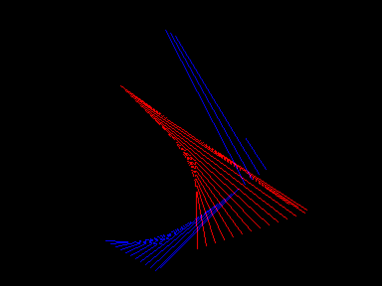

Першим демо для Ентерпрайза можна вважати **Nick Demo**. Вихідний код якої був опублікований у технічній документації комп'ютера як приклад роботи з графічним процессором [Nick](hardware/hm-nick.md). Демо візуально схоже на класичний скрінсейвер з лініями у Windows.  
  
Другою може рахуватись [демонстраційна програма](https://www.youtube.com/watch?v=hEDP8ofKs_M) з касети що йшла у комплекті з кожним комп'ютером. Вона була дещо примітивною і написаною на Бейсіку, але усім закарбувалось у пам'ять вилітаюче знизу лого комп'ютера з самого початку демонстрації. У кінці 2018 року навіть було зроблене [невеличке новорічне привітання](https://youtu.be/qXntH5I1IWk) з тим самим ефектом.  
  
[Nasa Guy](https://www.youtube.com/watch?v=V_Q29GuhDqk)  
Найпоширенішим в Угорщині вважається збірник невеличких демок що являють собою невеличкі зациклені анімації.  
Частина анімацій узято з програм германського клуба користувачів Ентерпрайзу. У деяких вбудовано простий програвач .SNG файлів від "The Music Studio" з Atari 8-bit, а в інших звучать оцифровані семпли. Ці демки нерідко дописували на другу сторону касет з іграми, що продавались в Угорщині.  
  
## Найбільш цікаві демки минулого сторіччя  
  
Від креативного творця ігор (про якого згадується вище) виходило декілька великих демок з інтерактивними частинами:  
[Ork Demo](https://www.youtube.com/watch?v=5Eg14WLJmEk)  
[Ork Megademo 2](https://www.youtube.com/watch?v=oH5QXKoWRTg)  
[Ork Megademo 3 disc 1](https://www.youtube.com/watch?v=oBjTMR7dO1c)  
[Ork Megademo 3 disc 2](https://www.youtube.com/watch?v=lKhmY_Wmu5Q)  
  
Трішки демок від інших виконавців:  
[Megademo 3](https://www.youtube.com/watch?v=ZAnOCFJQOeU)  
[Scroll Demo](https://www.youtube.com/watch?v=7wFU3LIbymQ)  
  
та найменше демо:  
Small Demo [P1](https://www.youtube.com/watch?v=yjJbtodF3Hg) [P2](https://www.youtube.com/watch?v=sYo3r0d9nBg) [P3](https://www.youtube.com/watch?v=oUbqdUMcsTA) [P4](https://www.youtube.com/watch?v=Q1uUFfyoC90) [P5](https://www.youtube.com/watch?v=TMxDSPLY8GA) [P6](https://www.youtube.com/watch?v=jhLVP9T59dM) [P7](https://www.youtube.com/watch?v=j0cK19AnxsY) [P8](https://www.youtube.com/watch?v=YvJ33MIECDw) [P9](https://www.youtube.com/watch?v=7Jsoc7kT0yk)  
(раніше ЮТуб дозволяв створювати меню та інтерактивні посилання, тому відео розбите на частини)  
  
## Сучасні демки  
  
Яку демку можна зустріти на багатьох платформах? Звісно [Bad Apple!](https://youtu.be/44whXrpVH08). Тут вона являє собою програвач "відео" поєднаний з MIDI-плеєром. Але замість оригінальної мелодії у MIDI-форматі (бо не знайшли) грає ремікс, що, як на мене, не дуже прикольно.  
  
Є ще дві версії Нянкет - з оригінальною мелодією, та оцифрованою різдвяною композицією:  
[Nyan Cat](https://www.youtube.com/watch?v=G16IJwLWY8w)  
[Nyan Cat Xmas edition](https://www.youtube.com/watch?v=rLh4zAROFTo)  
  
З "серйозних" авторів засвітились **Genesis Project** (які зазвичай креативнічають на Commodore 64) з двома демками:  
[Bars 1k](https://youtu.be/KXEv9U6D24Y)  
[First Contact](https://www.youtube.com/watch?v=4TwNqF1eumE)  
  
Можна згадати ще [Core](https://www.youtube.com/watch?v=6r3y0hfY0dw), що зайняла перше місце на **Enterprise DevCompo #2**.  
  
Найсвіжіша робота: [Piti Demo](https://youtu.be/88VzWbhnpGM)  
  
Ще одна цікава демка у мінімалістичному стилі (242 байти) що приймала участь у Lovebyte 2024: [LaFaSoMi](https://www.youtube.com/watch?v=p5LxWXk2w2c).  
  
Та [в мене на каналі](https://www.youtube.com/@SlashNetUA) можна ознайомитись з майже усіма іншими демками, що виходили на платформі.

# Емуляція на Ентерпрайзі інших платформ  
  
## ZX Spectrum 48/128  
  
### Апаратний емулятор ZX Spectrum

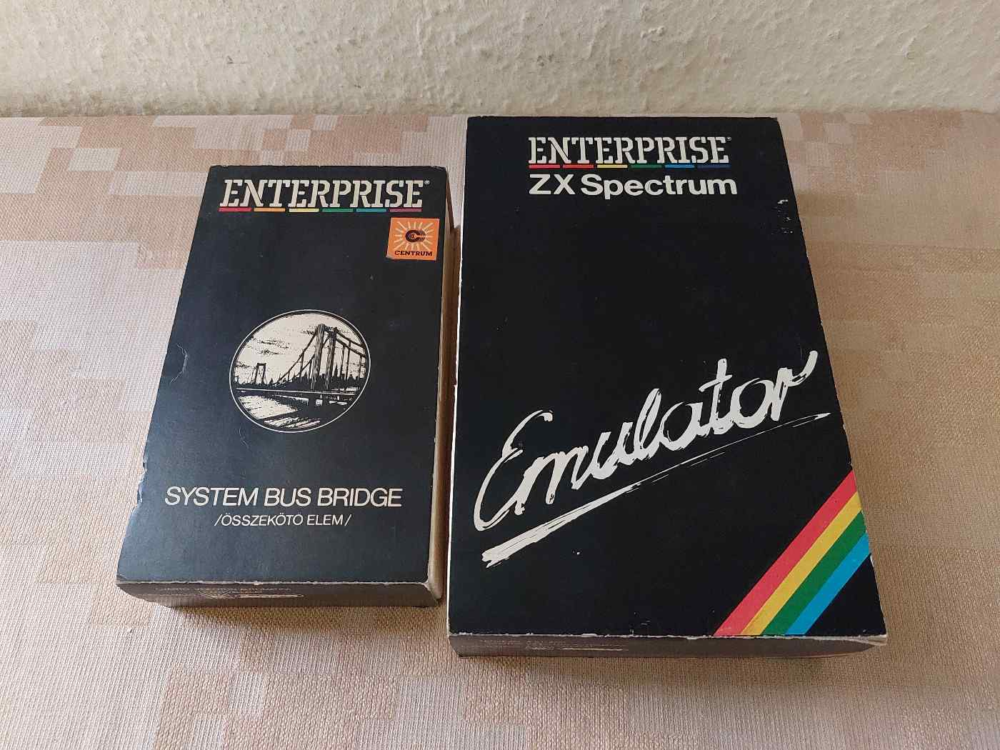 
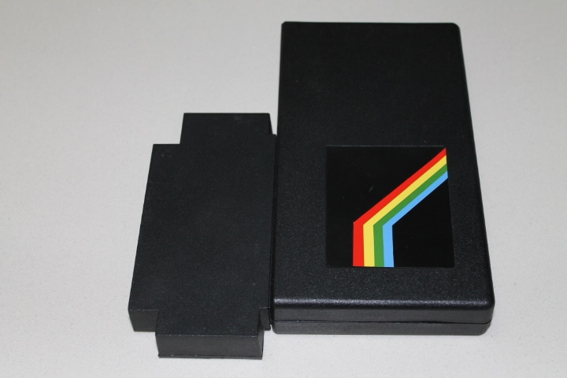 
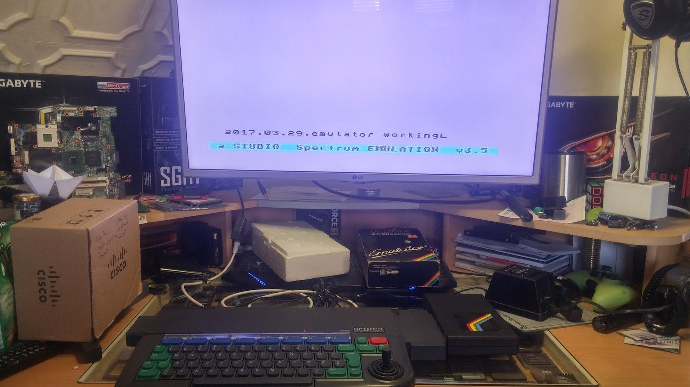 

Одним з перших емуляторів для комп'ютера Enterprise став [апаратний емулятор ZX Spectrum](hardware/he-zxemu.md) розроблений угорською компанією ['a' Studio](companies/a-studio.md) (у співпраці з компанією [Videoton](companies/videoton.md)).  
Випускався у формфакторі карти розширення, що підключається до порту системної шини, і "перетворював" Ентерпрайз у ZX Spectrum 48k який міг запускати близько 80% ігор, завантажуючи їх з оригінальних касет. Не працювали ігри з турбозавантаженням та ті що напряму використовували функції ПЗП Спектрума.  
  
Великим недоліком було те, що для виходу з емулятора необхідно було кожного разу від'єднувати карту розширення від комп'ютера. А по друге дисковий інтерфейс [EXDOS](hardware/hd-exdos.md) ніяк не був задіяний. Ці недоліки пізніше були виправлені ентузіастом [ZozoSoft](peoples/community/zozosoft.md), який вніс зміни як в апаратну частину емулятора, так і у програмну. Завдяки цьому підвищилась до 95% кількість ПЗ що можна було запускати. До того ж було додано можливість виходу з емулятора у Бейсік Ентерпрайза, можливість працювати одночасно з дисковим інтерфейсом завантажуючи Спектрум-програми як файли з дисків, з'явилась функція "Magic" (для збереження стану емуляції) та робота з POKE-файлами (для нескінченного життя чи патронів).  
  
Емулятор був не дуже розповсюджений через вищевказані проблеми та й високу вартість, яка була трішки нижчою за ціну оригінального ZX Spectrum.  
  
### Перші програмні емулятори Спектрума
  
Поряд з цим користувачі комп'ютера маючи доступ до офіційної документації по адаптації програм зі Спектруму зрозуміли, що цей процес цілком можна автоматизувати помістивши ПЗП Spectrum у фреймворк, в якому апаратні частини (клавіатура, звук і процедури магнітофона) модифікуються для апаратного забезпечення EP. Кілька програмістів незалежно один від одного прийшли до цієї ідеї, і загалом було створено близько десятка простих програмних емуляторів Spectrum. Однак, хоча ідея здається чудовою, програмна емуляція має багато недоліків:  
- працюють лише програми, які працюють з апаратним забезпеченням тільки через підпрограми ПЗП,  
- некоректні кольори атрибутів (та відсутність FLASH-атрибуту).  
- програми що використовують переривання IM2.  
Через що у таких емуляторах працювали лише користувацькі програми та програми написані на Basic.  
  
### SP by Alexander Gusev  

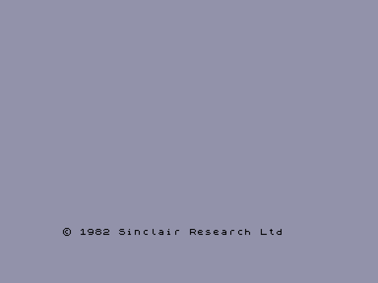 
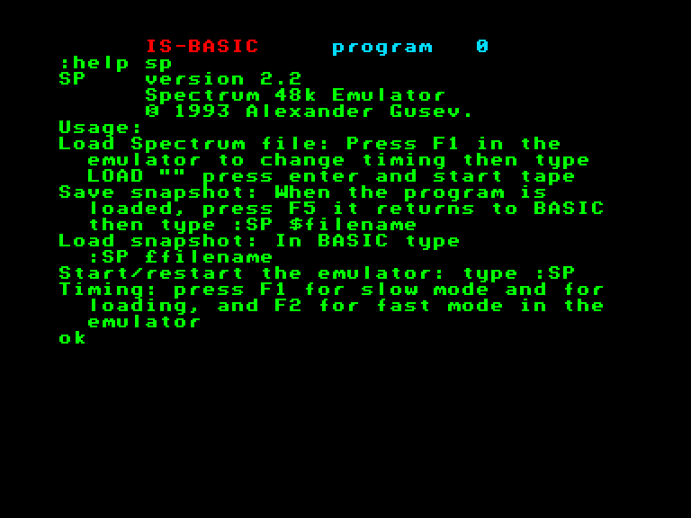 

Коли Enterprise з'явився на території колишнього СРСР, то [один з користувачів](peoples/ru/pers_alexandr-gusev.md) створив [власну версію емулятора](software/se-sp2.md) (спочатку монохромну, яка не обробляла атрибути кольорів, а пізніше і кольорову). Емулятор так само емулював ZX Spectrum 48K на Enterprise 128k та мав відносно непогану сумісність (40-50% працюючих програм). Вмів завантажувати ігри з оригінальних касет, та зберігати їх у вигляді снепшотів на касетний або дисковий накопичувач у рідному для Ентерпрайза форматі (через що, скоріше за все, у рекламних оголошеннях його і обізвали як емулятор-конвертер). Вміє емулювати джойстик Kempston.  

### SPEmu / SPEmu128

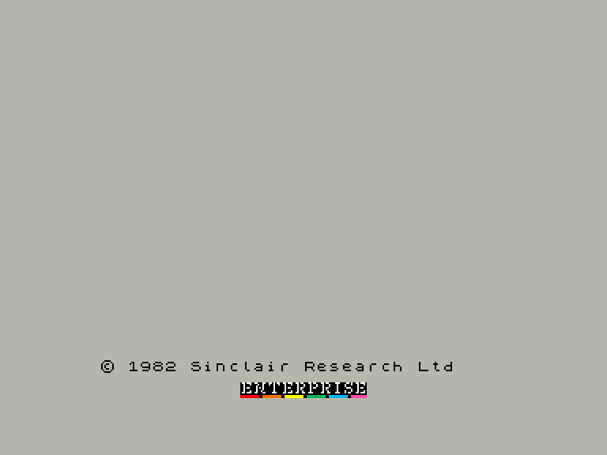 
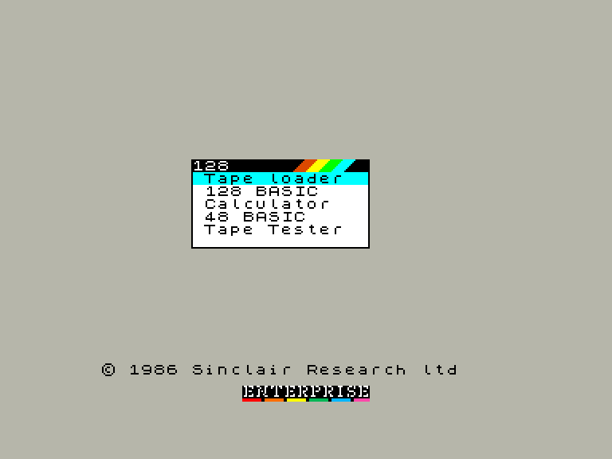 
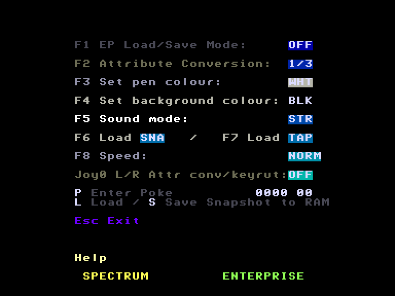 

А вже у 2014 році, на основі усіх попередніх розробок, був створений [сучасний програмний емулятор](software/se-spemu.md) як ZX Spectrum 48k так, навіть, і 128k (для Ентерпрайзів з розширеним ПЗП). Вони все ще емулюють моделі з завантаженням з касетних накопичувачів, але до того ж з'явилась можливість завантажувати ПЗ використовуючи поширені TAP та SNA файли у EXOS-форматі (як з касетного накопичувача, так і з пристроїв [EXDOS](hardware/hd-exdos.md)). Є можливість введення POKE-читів. Ентерпрайзи з розширеною оперативною пам'яттю мають можливість зберігати у пам'яті поточний стан емулятора та миттєво його відновлювати. Емулятор моделі ZX 128 до того ж вміє емулювати звук AY та Kempston-mouse.  
У ньому нормально працює 50-60% програм для ZX 48K та 30-40% програм для ZX 128K. До то ж рекомендується використовувати ROM-версії емуляторів, щоб нормально працювати з іграми, що "полюбляють" записувати у область ПЗП реального Спектрума (а таких, як на диво, багато).  
  
Проблеми є з іграми, що використовують турбозавантаження, та розпакування виконуваного коду (під час своєї роботи). Емулятор, після завантаження будь якої ігри, передивляється її код та патчить критичні ділянки програм. Але якщо виконуваний код розпаковується під час виконання, то відповідно, дана операція не буде виконана і ПЗ не буде коректно працювати.  

<iframe src="https://www.youtube.com/embed/wn5xpLbQLgo"  
style="width:75%; aspect-ratio:16/9;" allowfullscreen></iframe>

  
*Я зазвичай користуюсь сучасним [SPEmu](software/se-spemu.md), але деякі ігри нормально працюють лише у старому [SP](software/se-sp2.md).*  

> [!NOTE]
> Хочу зауважити, що ці два вищеназвані емулятори напевно коректніше називати автопатчерами, які автоматично та брутально модифікують код програм щоб вони могли хоч якось працювати на Ентерпрайзі. Не вірте тим хто запевняє, що Ентерпрайз є Спектрум-сумісною машиною.
>   

## Sinclair ZX81  

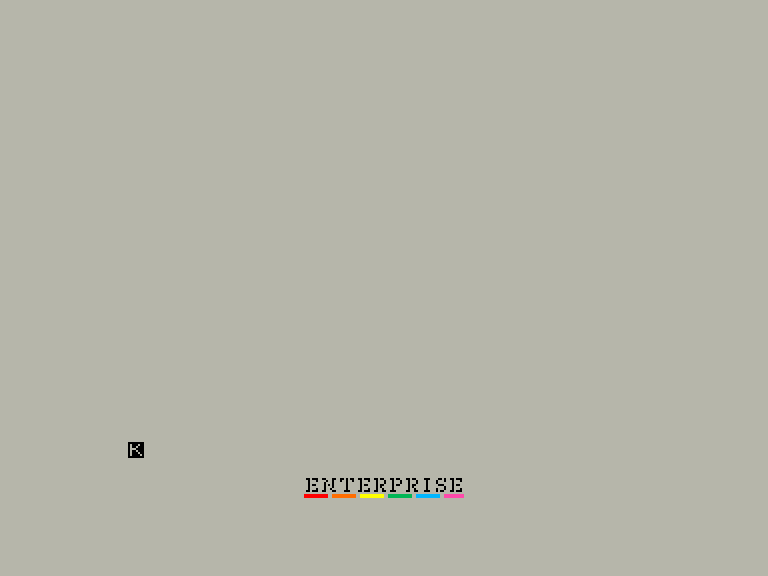 
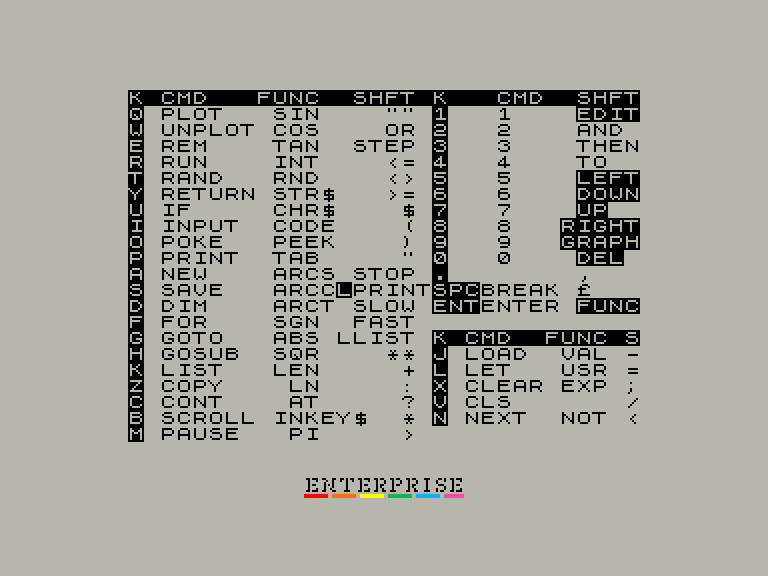 

[Сучасний емулятор](software/se-zx81emu.md) заснований на версії для Спектруму, але використовує апаратні можливості [Nick](hardware/hm-nick.md). Так як в цьому комп'ютері є всього лише 16K оперативної пам'яті, то емулятор буде працювати і на Enterprise 64. Успішно запускається десь 75-80% програм, які можна завантажувати як з касетного накопичувача, так і з диску у вигляді розповсюджених файлів \*.P. Але, нажаль, емулятор має проблеми з програмами, що використовують, так званий Hi-Res mode.  
  
## Amstrad CPC  

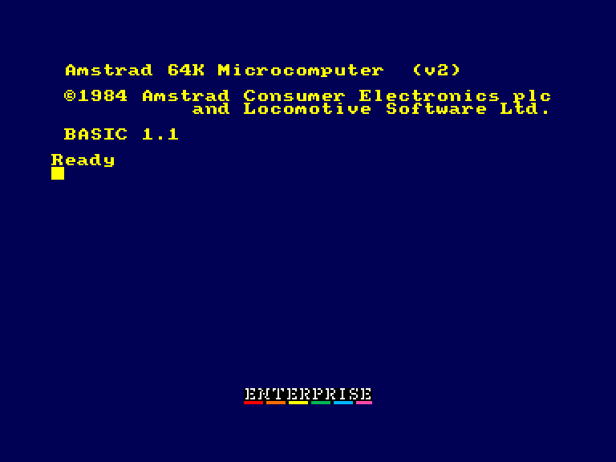

[Сучасний емулятор](software/se-cpcemu.md) комп'ютера Amstrad CPC 664 (тобто дискової версії з 64 КБ ПЗП), що працює на стандартному Ентерпрайзі 128К. Вміє емулювати аудіочип AY. Успішно запускається десь 15% програм, але зважаючи на те що загальний об'єм ПЗ для цієї платформи є досить великим, то і такий процент є відносно непоганим результатом. З усіма перевіреними програмами можна ознайомитись на [цій сторінці](http://ep128.hu/Ep_Games/Leiras/Amstrad_CPC_Program_Pack.htm).  
  
Основні проблеми емуляції наступні:  
- через апаратні особливості, інколи на екрані (зазвичай у Бейсіку) може з'являтись горизонтальна лінія з "сміттєвими" даними.  
- не працюють програми, що звертаються до I/O портів, використовують AMSDOS, та виконують запис у область ПЗП.  
- частина кольорів палітри 16-колірного режиму, через особливості відеопроцесора Ентерпрайза, буде некоректна.  
  
Завантажувати програми можна як з касетного так і з дискового накопичувача, попередньо витягнувши їх з образів диску (.DSK).  

<iframe src="https://www.youtube.com/embed/5tYUMWT6Fow"  
style="width:75%; aspect-ratio:16/9;" allowfullscreen></iframe>

## Videoton TVC  

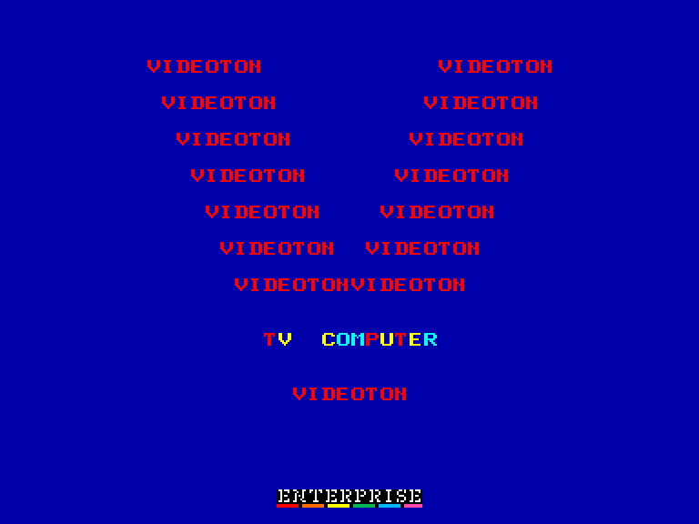 
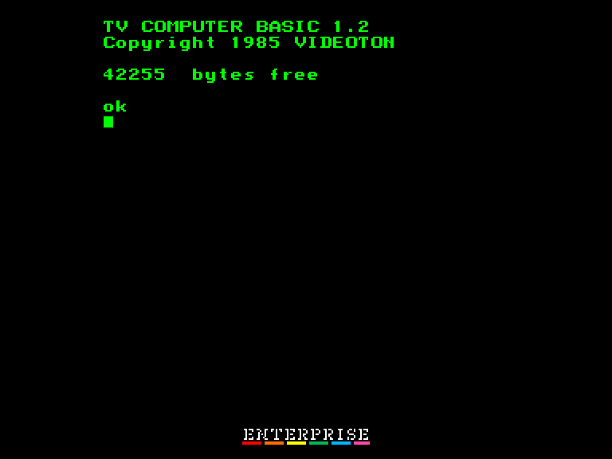 

[Сучасний емулятор](software/se-tvcemu.md) платформи Videoton TVC 64 (касетна версія)  
Цей емулятор використовує ті ж самі прийоми для емуляції що і попередній. Тому і недоліки в нього майже ідентичні: не працюють програми що використовують I/O порти та апаратні розширення, та будуть некоректні кольори у 16-колірному режимі екрану.  
Перелік програм, що працюють у емуляторі можна переглянути на [цій сторінці](http://ep128.hu/Ep_Games/Leiras/TVC_Program_Pack.htm).  
  
<iframe src="https://www.youtube.com/embed/SO6pUwTECfs"  
style="width:75%; aspect-ratio:16/9;" allowfullscreen></iframe>

## Commodore VIC-20  

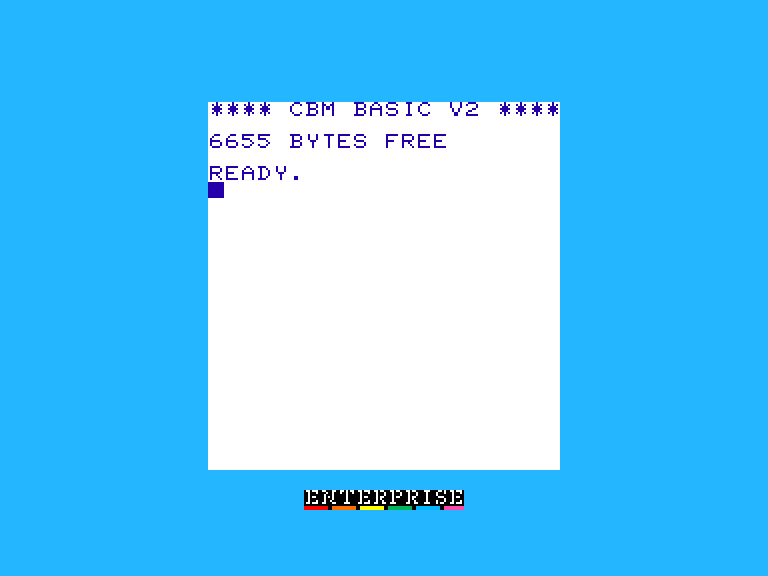 
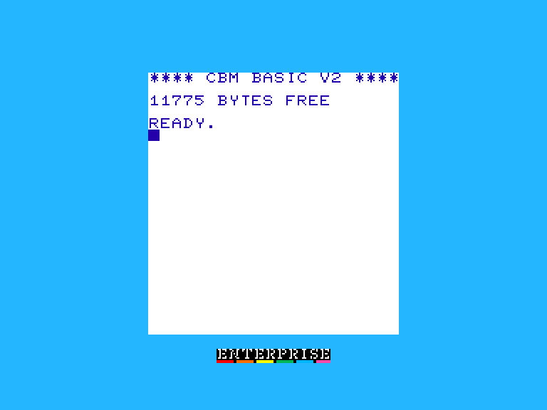 

[Емулятор](software/se-vic20emu.md) заснований на версії з SAM Coupe. Запускає близько 60% програм, але через не дуже високу швидкодію не усі програми будуть працювати з комфортною швидкістю (тому емулятор бажано запускати на розігнаній машині). Завантажувати програми можна лише у форматі PRG-файлів. Підтримується емуляція машини VIC-20 з розширеннями пам'яті (+3 КБ та +8 КБ).

# Музика  
  
Для музики було створено декілька редакторів/трекерів, та різноманітних плеєрів.  
  
Одним з популярних був **Music Box**, бо багато демок використовували музику у його форматі. Але він не підтримує спеціальні ефекти [Dave](hardware/hm-dave.md).  

Демо що використовує музику створену у цьому трекері:   

<iframe src="https://www.youtube.com/embed/UYMI9ILq7y0"  
style="width:75%; aspect-ratio:16/9;" allowfullscreen></iframe>

  
Ще одним редактором був **RockDigi**, у якому було створено музику як для декількох демок, так і ігор.  

Демо що використовує музику створену у цьому трекері:   

<iframe src="https://www.youtube.com/embed/eYl7sB7TN-k"  
style="width:75%; aspect-ratio:16/9;" allowfullscreen></iframe>

Mod-файли, що в той час були популярними на ПК та Amiga, теж добрались до Ентерпрайза. Невеличкі файли (розміром до ≈64KB) певним чином конвертувались у спеціальний формат та програвались у **Digitrax Module Player**.  

<iframe src="https://www.youtube.com/embed/gG8U-RqtCns"  
style="width:75%; aspect-ratio:16/9;" allowfullscreen></iframe>

**WAV Sample Player**/**WAV Player** вміє програвати 8-бітні нестиснені WAV-файли використовуючи усю доступну оперативну пам'ять, та дозавантажує (з паузами) якщо файл завеликий. Підтримуються наступні формати: WAV (RIFF,NIST), AIFF, IFF.  
  
В наш час з'явились нові плеєри для інших популярних форматів.  
  
**SID Player** вміє програвати коммодорівські музичні файли SID (PSID до 60KB) використовуючи для цього як сам [Dave](hardware/hm-dave.md), так і зовнішню [SID-карту розширення](hardware/hs-sidcard.md) (є лише недороблений прототип цієї карти, але [ep128emu](emulators/em-ep128emu.md) вміє її емулювати). Заснований на SID-плеєрі з SAM Coupé.  
Програвач має певні обмеження, оскільки емуляція чипу 6510 використовує більшу частину часу Z80, тому відтворюються тільки прямокутні хвилі, огинаючі емулюються в перериванні 50 Гц, а композиції відтворюються лише зі швидкістю 50 Гц, 60 Гц або 100 Гц  

<iframe src="https://www.youtube.com/embed/6CKt9noxA7s"  
style="width:75%; aspect-ratio:16/9;" allowfullscreen></iframe>

**SIDBasic**  
Цьому плеєру для програвання SID-музики достатньо стандартної машини без додаткових розширень. Він використовує семпли та конвертовані певним чином SID-дані, що містять частоту SID, ШІМ (широтно-імпульсну модуляцію), та інші параметри.  
Але SID-файли попередньо мають бути перетворені у файли M64.  
Пізніше цей плеєр був [портований на ZX Spectrum 128](https://worldofspectrum.org/forums/discussion/54160/c64-sid-player-coming-soon-to-specy-128) (але з додатковими обмеженнями)  

<iframe src="https://www.youtube.com/embed/8UxG_sjeuyM"  
style="width:75%; aspect-ratio:16/9;" allowfullscreen></iframe>

SID плеєр використовується у конверсіях декількох ігор (Attack of the PETSCII Robots, Green Beret, International Karate).  
  
**PT3 Player**  
Як зрозуміло з назви плеєр вміє програвати файли PT3 (Pro Tracker 3) з платформи ZX Spectrum. Використовується емуляція AY.  
  
**MOD Player**  
Програвач MOD-файлів. Заснований на MOD-плеєрі з SAM Coupé.  
Для програвання рекомендується розігнана машина, оскільки на стандартній частоті будуть чутними зайві шуми. У відео записане звучання на різній частоті (для порівняння).  

<iframe src="https://www.youtube.com/embed/eNet1CQtnCc"  
style="width:75%; aspect-ratio:16/9;" allowfullscreen></iframe>

**MID Player**  
Програвач MIDI-файлів (точніше їх конвертованих версій).  
Додатково було модифіковано і емулятор [ep128emu](emulators/em-ep128emu.md) додаванням MIDI-входу для використання емулятора як аудіопристрою, щоб можна було просто адаптувати або писати власну музику (детальніше у [статті журналу ENTERPRESS](http://enterprise.iko.hu/magazines/Enterpress_2017_per_4_UK.pdf#page=3)).  
MIDI Player використовується у декількох [іграх](https://youtu.be/4s4Hb56hDo4) та демці [Bad Apple!](https://youtu.be/44whXrpVH08).  
Код плеєра нещодавно адаптували для Бейсіка щоб у програмах написаній на цій мові можна було використовувати MIDI-музику. Прикладом є простенька гра [Toligator](https://www.youtube.com/watch?v=K30-ux5UT3Y).  
  
[Плейлист з композиціями](https://www.youtube.com/playlist?list=PLLtDD9CPvGBBVGxf1g3kSoZ7AJz1M19l6) *(перше відео у плейлисті якраз відображає процес виводу міді-даних з аудіоредактора напряму у емулятор)*
  
**SNG Player**  
Простенький (з деякими особливостями) плеєр Атарі-шного формату SNG від "The Music Studio". Використовувався у [іграх](https://youtu.be/RVsIMRLbR3Y) (та демках) розроблених чи сконвертованих компанією ['a' Studio](companies/a-studio.md).  
  
У 2024 році у пісі-шний редактор **Furnace Tracker** додали можливість емулювати чип [Dave](hardware/hm-dave.md). Але для практичного застосування цей варіант створення музики поки що не дуже підходить: ті аудіоформати у які редактор вміє експортувати композиції мало придатні для відтворення на Ентерпрайзі.

<iframe src="https://www.youtube.com/embed/yQyuE0NnEh4"  
style="width:75%; aspect-ratio:16/9;" allowfullscreen></iframe>

<iframe src="https://www.youtube.com/embed/LBhCxxBlGZI"  
style="width:75%; aspect-ratio:16/9;" allowfullscreen></iframe>

# Основні інтернет-ресурси

[Список актуальних ресурсів](links.md)