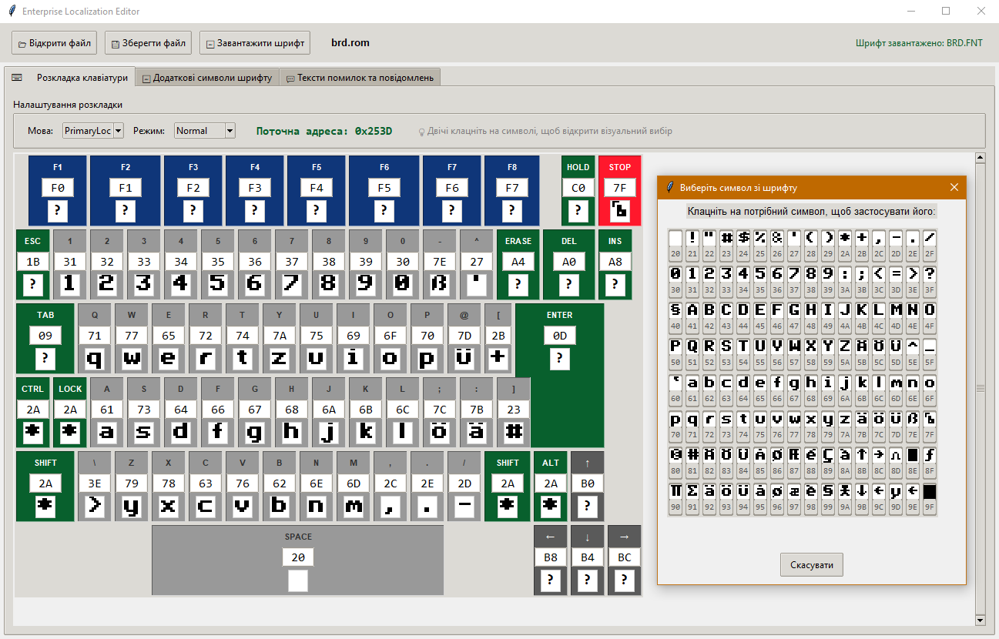

# Редактор файлів локалізацій

Цією програмою можна модифікувати файл [BRD.ROM](../software/ss-localizations.md) для створення [власних локалізацій](../software/mods/localization-mod.md).

Поточна версія підтримує лише редагування розкладки клавіатури.

Для зручності можна підвантажити [файл шрифту](../programming/tips-hints/fileformats/fmt_fnt-epfnt.md) і використовувати його для вибору потрібного символу при перевизначенні клавіши.

Клавіши **F1**-**F8**, **Shift**, **Ctrl**, **Lock**, **Alt** бажано не модифікувати. До того ж треба розуміти, що символ **127** (**7Fh**) не можна призначити на клавішу (для його введення). Замість нього буде призначена клавіша **Stop**.