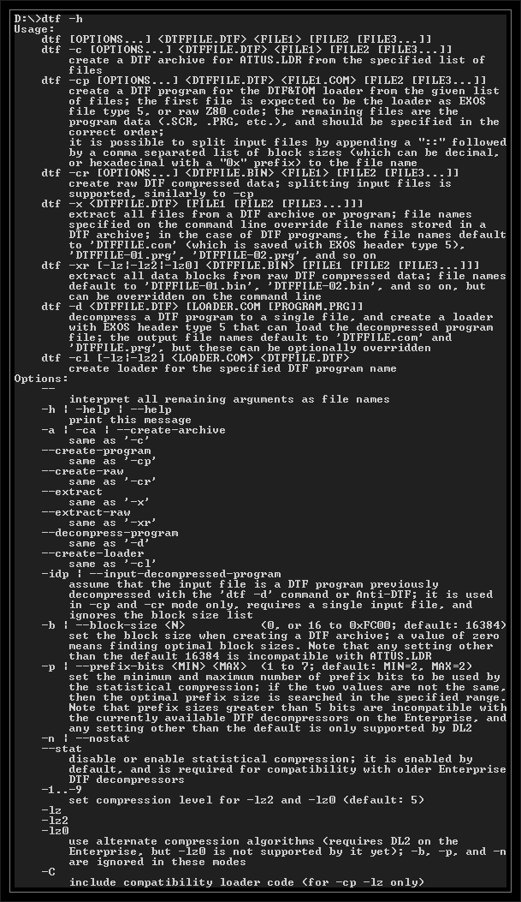

# DTF compressor

<div style="text-align:center;">
</div>


DTF can also be used for creating packed files that are easy to load with RST 28H calls (these work similarly to EXOS 6, except the channel number is always 1, and the block size is determined at compression, so BC is ignored). It supports the same algorithms as [epcompress](pc_epcompress.md), use `-lz` for the **-m3** method, and `-lz2 -9` for **-m2**.  
  
With 'dtf', the pack file is already opened on channel 1 when the original loader is started, and each compressed data block can be read with RST 28H (DE is the start address). The decompressor code uses the area under 100H.  
```
dtf -cp -lz PACKFILE LOADER.COM DATA1 DATA2 ...  
dtf -cl -lz LOADER2.COM PACKFILE  
```
  
These commands pack a program and its data using the simplest and fastest algorithm, and create a new loader for the packed file.