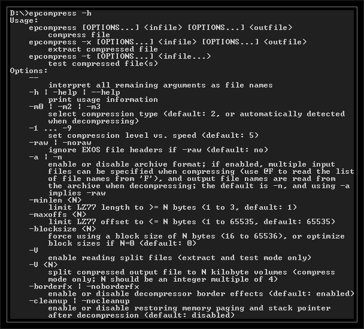

# epcompress

Консольна утиліта для стиснення даних та програм. Входить до комплекту програм емулятора [em-ep128emu](../emulators/em-ep128emu.md).

Автор: [istvanv](../peoples/community/istvanv.md)  
[Github](https://github.com/czo/ep128emu/tree/master/util/epcompress)

> **epcompress -m2** is a similar format to [Exomizer](https://github.com/bitshifters/exomizer), with some tweaks.  
**epcompress -m3** has a few percents worse compression ratio, but the decompressor is simple, fast, and only requires a small amount of memory (it does not use any tables).  
**epcompress -m0** is the most complex format, it may compress better than the -m2 mode, but it is not worth it most of the time because of the large and slow decompressor.  
>   
> epcompress allows for creating **.com** files that uncompress to greater than 47.75 KB size, as long as the compressed version of the program does not exceed that limit. With the **-m3** method, it is possible to use all memory from **100H** to **FFFFH**, the others reduce the upper limit because of the extra space required by the decompressor code and data.
> 
> Here is a comparison of the compression ratios with a few files

| File                           | Original | Gzip (7-zip) | Exomizer 2.0.9 | epcompress -m0 -9 | epcompress -m2 -9 | epcompress -m2 -5 | epcompress -m2 -1 | epcompress -m3 |
| ------------------------------ | -------- | ------------ | -------------- | ----------------- | ----------------- | ----------------- | ----------------- | -------------- |
| ARIZONA.RAW (Interlace Demo 3) | 55218    | 41337        | 43950          | 41117             | 43467             | 43532             | 43822             | 44579          |
| BATMAN.APL                     | 44288    | 29920        | 30037          | 29191             | 29665             | 29727             | 29998             | 30472          |
| BATMAN.COM                     | 7552     | 3195         | 3246           | 3097              | 3247              | 3253              | 3254              | 3554           |
| EXOLON.PRG (Attus)             | 37538    | 21291        | 21526          | 20788             | 21193             | 21272             | 21510             | 21839          |
| EXOLON.SCR (Attus)             | 6913     | 1960         | 1999           | 1836              | 1894              | 1905              | 1966              | 2164           |
