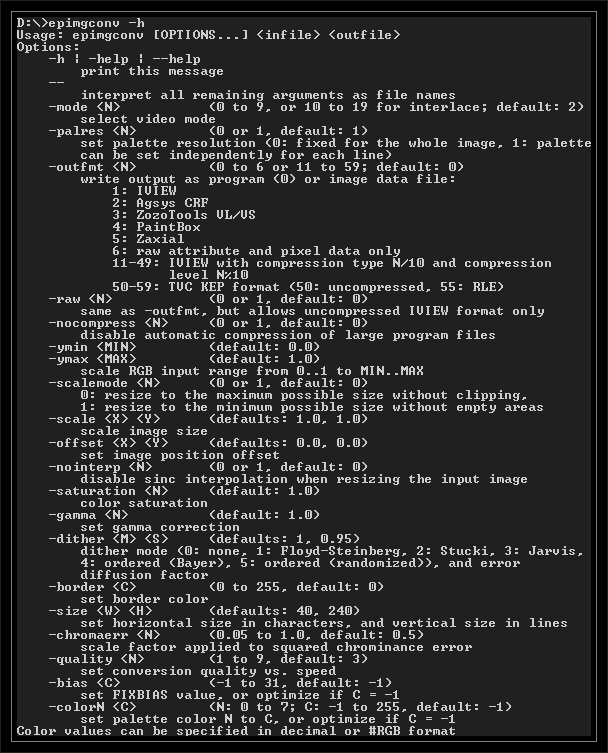

# epimgconv

Консольна утиліта для перетворення зображень у формат для Enterprise. Отримані зображення можна переглянути на EP за допомогою програми IView. Також є можливість експорту у формати графічних редакторів Agsys, PaintBox та Zaxial. Підтримувані формати зображень: JPG, BMP, PNG, GIF та XPM. Входить до комплекту програм емулятора [em-ep128emu](../emulators/em-ep128emu.md).

Автор: [István Varga](../peoples/community/istvanv.md)  
[Github](https://github.com/czo/ep128emu/tree/master/util/epimgconv)

# epimgconv (GUI)

Віконна версія програми.