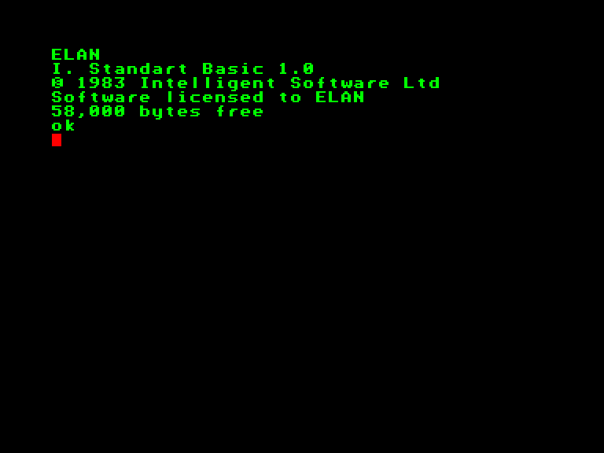
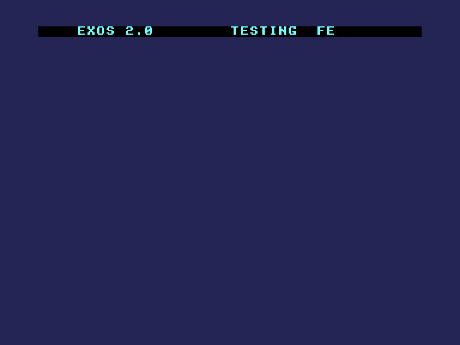
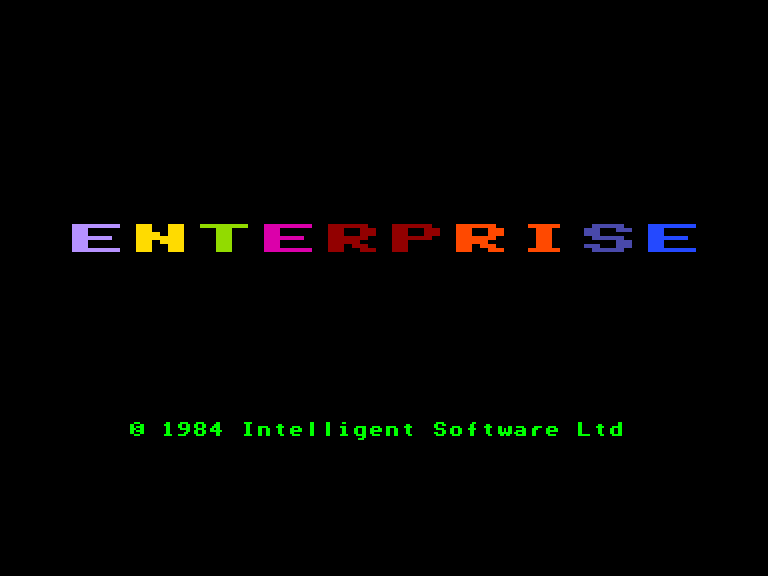
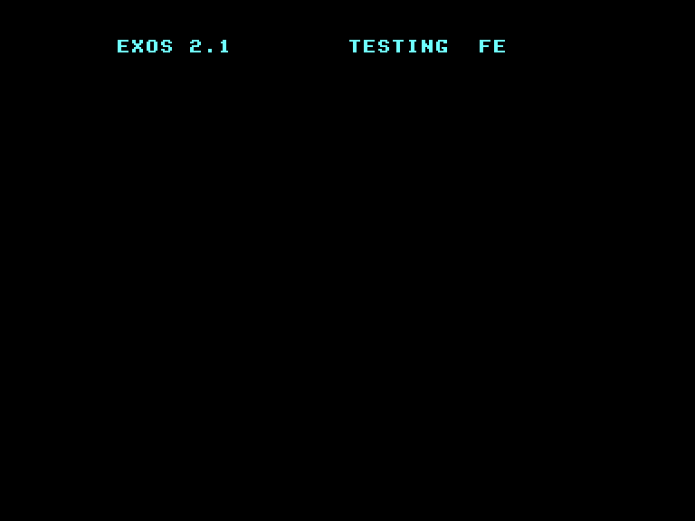
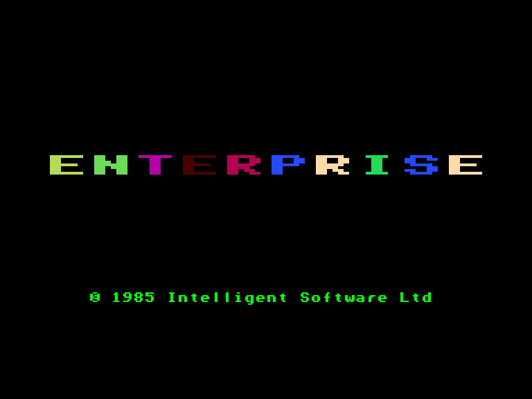
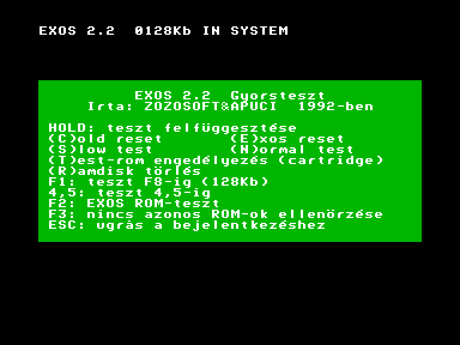
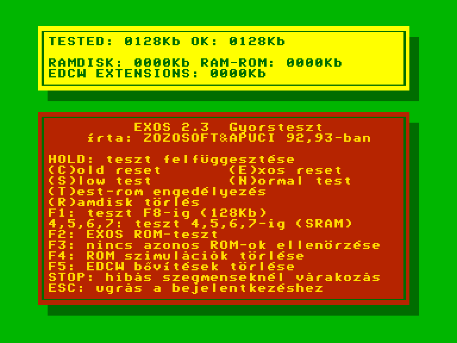
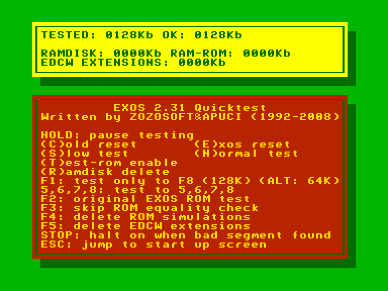
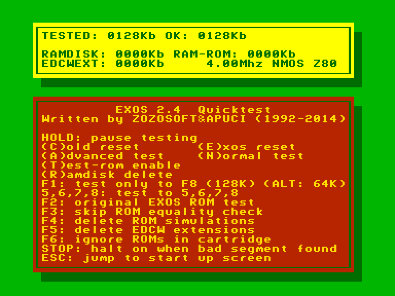

# Версії EXOS

На даний час найбільш вживані версії EXOS наступні:

 - **v2.0** - стокова версія у моделі **Enterprise 64**.
 - **v2.1** - стокова версія у моделі **Enterprise 128**.
 - **v2.4** - сучасна неофіційна версія з виправленням помилок та новим швидким тестом ОЗП для всіх моделей комп'ютера.

## v 1.x

 

*Приблизно так виглядав екран після включення комп'ютера*

Створено: **Intelligent Software Ltd.**  
Рік: **1983**  

Орієнтовно, могла бути встановлена у передпродажні моделі комп'ютерів із старою назвою **ELAN**. З дуже ранньої версії посібника користувача можна дізнатись, що стартовий екран (з великим написом `ENTERPRISE`) був відсутній і комп'ютер відразу переходив до командного режиму (тоді ще вбудованого) інтерпретатора Бейсіку. Мала назву **EROS** (Elan Rom Operating System).

> *"...EROS — назва, яку розробники обрали, дотримуючись давньої традиції називати операційні системи комп'ютерів на честь персонажів грецької міфології. Але маркетологи Enterprise змусили змінити її на EXOS..."* (Bruce Tanner)

## v 2.0

 

Створено: **Intelligent Software Ltd.**  
Рік: **1984**    

Офіційна версія, що була встановлена у **Enterprise 64**. Екран тесту оперативної пам'яті пофарбований у випадковий колір.

### Керування перезапуском

`Reset` (подвійний): **Cold reset** (в деяких некоректно написаних програмах може не спрацьовувати).  

`Reset` (одинарний): **Warm reset** - Теплий перезапуск не виконує тестування оперативної пам'яті або пошук модулів ПЗП. Уся пам'ять, виділена користувачеві, залишається недоторканою, а будь-які підключені розширення системної пам'яті або пристрої користувача зберігають свій стан. Однак усі канали примусово закриваються, а всі пристрої ініціалізуються повторно; будь-яка оперативна пам'ять, що була виділена під буфери каналів, звільняється. Після цього керування передається користувацькій підпрограмі (якщо вона була передбачена). Таким чином деякі програми можуть обробляти натискання кнопки Reset (наприклад, в інтерпретаторі IS-Basic програма не видаляється з пам'яті, у IS-DOS виконується "аварійне" завершення поточної програми і перехід до командного рядка, а в деяких іграх виконується зберігання таблиці лідерів у файл).

## v 2.1

 
 

Створено: **Intelligent Software Ltd.**  
Рік: **1985**  

Офіційна версія, що була встановлена у **Enterprise 128**.

Крім виправлення помилок були додані наступні покращення:

  - нова системна змінна що керує методом накладання цифрових відеоданих з шини розширення на екран.
  - користувацькі процедури апаратних переривань.

### Керування перезапуском

`Reset` (подвійний): **Cold reset** (в деяких некоректно написаних програмах може не спрацьовувати).  

`Reset` (одинарний): **Warm reset** - Теплий перезапуск не виконує тестування оперативної пам'яті або пошук модулів ПЗП. Уся пам'ять, виділена користувачеві, залишається недоторканою, а будь-які підключені розширення системної пам'яті або пристрої користувача зберігають свій стан. Однак усі канали примусово закриваються, а всі пристрої ініціалізуються повторно; будь-яка оперативна пам'ять, що була виділена під буфери каналів, звільняється. Після цього керування передається користувацькій підпрограмі (якщо вона була передбачена). Таким чином деякі програми обробляють натискання кнопки Reset (наприклад, в інтерпретаторі IS-Basic програма не видаляється з пам'яті, у IS-DOS виконується "аварійне" завершення поточної програми і перехід до командного рядка, а в деяких іграх виконується зберігання таблиці лідерів у файл).

## v 2.2 (CYR)

Створено: **Enterprise Computers GmbH** та **'a' Studió**  
Рік: **1989**  

Є модифікацією версії **2.1** для комп'ютерів що були призначені для шкільних класів колишнього СРСР.
Через стислі терміни розробки CRC-перевірку цілістності прошивки було видалено.

## v 2.2 (unofficial)

 
 

Створено: **ZozoSoft** та **Apuci**.  
Рік: **1992**  

Є модифікацією офіційної версії **2.1**. Одним з головних нововведень цієї версії є швидкий тест оперативної пам'яті, який працює суттєво швидше, ніж стандартний. Раніше користувачі систем із розширенням ОЗП (200-300 КБ і більше) стикалися з тривалим очікуванням завершення процедури тестування пам'яті, яку неможливо було перервати.

## v 2.3 (unofficial)

 
 

Створено: **ZozoSoft** та **Apuci**.  
Рік: **1993**  

## v 2.31 (unofficial)

 
 

Створено: **ZozoSoft** та **Apuci**.  
Рік: **2008**  

Версія з екраном тестування на різних мовах (EN, ES, HU) .

## v 2.32 (unofficial)

 
 

Створено: **ZozoSoft** та **Apuci**.  
Рік: **2010**  

Версія з екраном тестування на різних мовах (EN, ES, HU) .

## v 2.4 (unofficial)

 
 

Створено: **ZozoSoft** та **Apuci**.  
Рік: **2014**  

### Керування перезапуском та тестом пам'яті

`Reset` (подвійний): **Reset** - Тестування пам'яті не виконується без необхідності, завантажені системні розширення не видаляються з пам'яті і виконується перехід на стартовий екран.  

`Reset` (одинарний): **Warm reset** - Теплий перезапуск не виконує тестування оперативної пам'яті або пошук модулів ПЗП. Уся пам'ять, виділена користувачеві, залишається недоторканою, а будь-які підключені розширення системної пам'яті або пристрої користувача зберігають свій стан. Однак усі канали примусово закриваються, а всі пристрої ініціалізуються повторно; будь-яка оперативна пам'ять, що була виділена під буфери каналів, звільняється. Після цього керування передається користувацькій підпрограмі (якщо вона була передбачена). Таким чином деякі програми можуть обробляти натискання кнопки Reset (наприклад, в інтерпретаторі IS-Basic програма не видаляється з пам'яті, у IS-DOS виконується "аварійне" завершення поточної програми, а в деяких іграх виконується зберігання таблиці лідерів у файл).

`Reset`+`C`: **Cold reset** - Виконується звичайна ініціалізація системи як при увімкнені комп'ютера.  

`Reset`(подвійний)+`E` або `Reset`+`C`+`E`: **Cold reset** з використанням старої процедури тестування (як у v2.0-2.1).  

`Reset`+`C`+`N`: **Запустити оригінальний алгоритм тестування оперативної пам'яті EXOS для перевірки сегментів RAM**. Це найнадійніший, але водночас і найповільніший тест. Він необхідний лише після встановлення нового розширення пам'яті.

`Reset`+`C`+`S`: **Повільний тест**. Він схожий на швидкий тест, але перевіряє усі байти. Краще користуватись швидким тестом.  

`Reset`+`C`+`T`: **Enable TEST_ROM feature**. Normally the EXOS doesn't search for the `TEST_ROM` because the new internal test program is better than the traditional fast test programs. But with the **T** key you can run the `TEST_ROM` program. An extra feature: the EXOS searches at all segments for `TEST_ROM`. (The original EXOS searches only at the **04H** segment.) (MIT JELENT?)  

`Reset`+`C`+`R`: **Видалити RAMDISK**. Зазвичай EXOS розпізнає та залишає [RAMDISK](../../manuals/dos-commands/cmd-ramdisk.md). Якщо ви хочете його видалити використовуйте цю опцію.  

`Reset`+`C`+`F1`: **Перевірити та задіяти лише 128 кБ ОЗП**. Деякі некоректно написані програми працюють лише на оригінальних конфігураціях з 128 кБ.  

`Reset`+`C`+`ALT`: **Перевірити та задіяти лише 64 кБ ОЗП**. Це буде корисним для ігор написаних для EP64, які працюють занадто швидко на машинах з 128 кБ (і більше), такі як **Tombs of Doom** чи **The Abyss**.  

`Reset`+`C`+`4,5,6,7`: Having SRAM chips in the cartridge they can be used as memory expansion by pressing one of these keys. The memory test runs to **04H**, **05H**, **06H**, **07H** segments. (MIT JELENT?) Originally run only to **08H** for searching RAM segments. (MIT JELENT?)  

`Reset`+`C`+`F2`: **Застосувати старий метод пошуку ПЗП в сегментах пам'яті**. New EXOS searches for ROM extensions at ALL segments. (MIT JELENT?) It is great for using higher capacity EPROMs, you can burn more programs to a single EPROM. But if you want you can return to the normal EXOS ROM search routine with the **F2** key. The original routine tests only **04H**-**07H**, **10H**, **20H**,...**F0H** segments. (MIT JELENT?) This feature is practical for temporarily disabling some ROM extensions for some compatibility reasons. 

`Reset`+`C`+`F3`: **Не перевіряти ідентичність ROM.** Зазвичай, якщо два сегменти ПЗП ідентичні (порівнюються перші 255 байт), до списку ROM додається лише той, що знаходиться в нижчих адресах. Наприклад, цю функцію рекомендовано використовувати, коли ви хочете випробувати картридж із BASIC, але внутрішній BASIC у ПЗП комп'ютера блокує його. Якщо ви натиснете **F3**, BASIC із картриджа також буде додано до списку ROM, і він запуститься.

`Reset`+`C`+`F4`: **Видалити симуляції ROM**. У новій версії EXOS ви можете симулювати розширення ПЗП в оперативній пам'яті. За замовчуванням, перед тестуванням будь-якого сегмента як пам'яті RAM, нова підпрограма перевіряє, чи починається він із рядка `EXOS_ROM` або `TEST_ROM`? Якщо так, цей сегмент пропускається під час тесту RAM і може бути розпізнаний як ROM. 

`Reset`+`C`+`F5`: **Видалити розширення EDCW**. Розширення для [EDC Windows](http://www.ep128.hu/Ep_Util/Edcw.htm) обробляються аналогічно симуляціям ПЗП.  

`Reset`+`C`+`F6`: **пропуск пошуку ПЗП в картріджі**. Це було розроблено для [SD-картриджа](../../hardware/hd-sd-card-adapter.md), Flash-пам'ять якого можна оновлювати безпосередньо з Enterprise. Оскільки мікросхема має поверхневий монтаж, її важко відновити у разі збою, якщо система взагалі не запускається через пошкоджений ROM. За допомогою цієї функції проблему можна вирішити та завантажити програму для відновлення Flash-пам'яті з дискети (для тих, хто має [EXDOS](../../hardware/hd-exdos.md)) або через аудіовхід.

`Reset`+`C`+`STOP`: **Зупинка при виявленні дефектних сегментів пам’яті (RAM)**. Ви можете побачити номери пошкоджених сегментів. Тестування можна продовжити, натиснувши будь-яку клавішу.

`Reset`+`ESC`: **Перейти до стартового екрану з логотипом Enterprise**. З деяких ігор неможливо вийти через те, що програма використовує адресу теплого перезапуску. Якщо під час скидання комп'ютера утримувати клавішу **Esc**, новий EXOS не виконує стандартну процедуру теплого перезапуску, а замість цього переходить до оригінальної процедури Enterprise. Завдяки цьому методу ваші попередньо завантажені розширення системи зберігаються, змінні EXOS (такі як час, дата) не скидаються тощо. Раніше, використовуючи програму, з якої важко вийти, вам довелося б вимикати та знову вмикати комп’ютер, через що вся ця інформація була б втрачена...

`Hold`/`Pause` (на екрані тестування): Призупинення процесу тестування.

