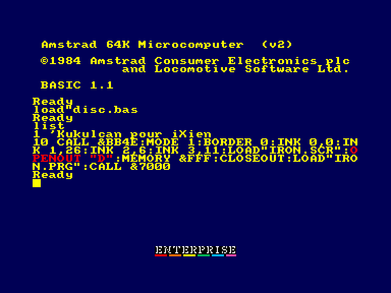

# CPCEmu

http://ep128.hu/Ep_Util/Amstrad_CPC_emu.htm

У даному емуляторі є невелика особливість із завантаженням зі стрічки (не в курсі чи це баг чи просто "фіча" емулятора).

Якщо у лоадері гри попадеться наступна конструкція (або подібна):

```
...
OPENOUT "D"
...
CLOSEOUT
...
```

, то потрібно до файлів гри додати ще один назвавши його як у команді **OPENOUT**. Вміст файлу може будь-який (достатньо одного байту). 

Можна обійтись і без нього, але тоді при виконання цієї команди треба призупинити відтворення аудіо і натиснути `Stop`. З'явиться напис `SAVING D`. Дочекатись появи напису `SEARCHING` і продовжити відтворення аудіо з програмою.

Для прикладу наведу лоадер гри Iron Sphere ("проблемна" команда виділена червоним кольором):



З лістнгу програми видно що файли потрібно розташувати в наступному порядку:

 - **DISC.BAS**
 - **IRON.SCR**
 - **D**
 - **IRON.PRG**

(або після завершення завантаження файлу **IRON.SCR** натиснути `Stop` та дочекатись коли система буде готова завантажувати файл **IRON.PRG**)

При завантаженні гри з дискового пристрою цього робити не потрібно. Просто на поточному диску створиться пустий файл **D**.

---

Є проблема із зчитуванням зовнішніх джойстиків за допомогою функції **INKEY(n)**.

джойстик 0 на лівий напрямок (74) генерує 128, а не 0

джойстик 1 не генерує ніяких значень на будь-які положення.


### Як перевіряти ігри на можливість запуску

Гра повинна мати дисковий реліз (DSK).

Файли гри спочатку потрібно видобути з образу диску. Найзручніше це робити використовуючи емулятор [WinAPE](http://www.winape.net):

 - запустити емулятор WinAPE.
 - натиснути `Ctrl`+`F1` для вибору образу диску (або через меню File → Drive A:  → Insert Disc Image...)
 - натиснути `Ctrl`+`Shift`+`F1` для відкриття вікна редагування образу (або через меню File → Drive A:  → Edit Disc...)
 - активувати чекбокс "Show System Files"
 - виділити усі файли, скопіювати їх у буфер обміну, та вставити у потрібну папку на диску

Перевіряючи запуск гри треба зважати на деякі нюанси:

- лоадер у вигляді Бейсік-файлу повинен обов'язково бути токенізованим (а не текстовим). Щоб виправити це у WinAPE його можна завантажити командою `LOAD "назва файлу"` та зберегти за допомогою `SAVE "назва файлу"` після чого витягнути з образу як описано вище.

- інколи у лоадері назви файлів можуть бути вказані без розширень: відповідні файли потрібно буде переназвати. 

- деколи лоадер не завантажує гру, і тому можна спробувати завантажити BIN-файл напряму. Інколи це спрацьовує.