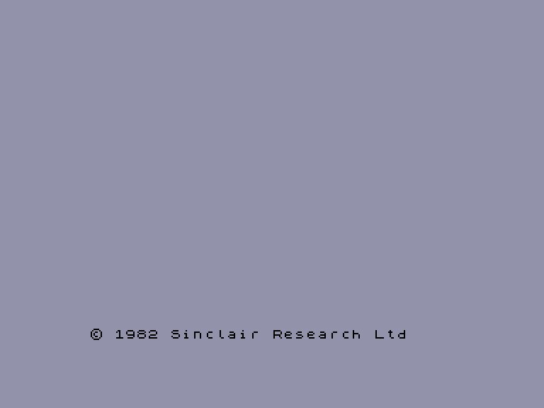

# SP 2.2

Емулятор комп'ютера **Sinclair ZX Spectrum 48**.

Автор: Alexander Gusev (1993 р.)  
Системні вимоги: Enterprise 128k  
EXOS-сумістність: низька (не працює на комп'ютерах з розширенням пам'яті)

Підтримка форматів для завантаження:
 - аудіовхід (у форматі стандартного сигналу для ZX Spectrum) 
 - файл снепшоту у власному форматі який можна завантажувати з EXOS-сумісних накопичувачів.

Підтримка форматів для зберігання:
 - аудіовихід (у форматі стандартного сигналу для ZX Spectrum) 
 - файл снепшоту у власному форматі який можна зберегти на EXOS-сумісний накопичувач.

Підтримка пристроїв введення:

| ZX Spectrum       | Enterprise                                                                                            |
| ----------------- | ----------------------------------------------------------------------------------------------------- |
| Kempston Joystick | [Internal Joystick](../sf-games/controllers.md) або [External Joystick 1](../sf-games/controllers.md) |

|                                                    |                                                |
| -------------------------------------------------- | ---------------------------------------------- |
|  |  |


## Робота з емулятором

### Гарячі клавіши (під час емуляції)

`F1`: збільшити таймаут доступу до пам'яті (система почне працювати із швидкодією оригінального ZX Spectrum)  
`F2`: повернути нормальний таймаут доступу до пам'яті  
`F5`: перейти у IS-Basic без переривання емуляції (для операцій із снепшотами). Введіть `:SP` щоб повернутись до емуляції ZX Spectrum.  
`Reset` (одинарний): очищення пам'яті Спектруму та вихід у IS-Basic (введіть `:SP` щоб відкрити початковий екран ZX Spectrum).

### команди EXOS

`:sp`: запустити емулятор (або повернутись до екрану емуляції)  
`:sp $назва_файлу`: зберегти поточний стан емулятора у снепшот.  
`:sp #назва_файлу`: завантажити снепшот в емулятор.  

### Нотатки

Перед будь-якими операціями з оригінальною касетою ZX (завантаженням чи збереженням) необхідно натиснути **F1**, щоб збільшити таймінг доступу до пам'яті, таким чином, щоб система запрацювала приблизно з такою ж швидкодією, як і оригінальний ZX Spectrum. Після завершення операцій з ZX-касетою натисніть **F2**, щоб відновити звичайний таймінг доступу до пам'яті.

Для збереження снепшоту у потрібний момент необхідно натиснути **F5** щоб повернутись до середовища Ентерпрайзу. Командою `:sp $.....` можна зберегти снепшот. Для повернення до поточної емуляції Спектруму введіть команду `:sp`.

Завантажити снепшот можна відразу після завантаження емулятора командою `:sp #.....`.

Завантажити емулятор а потім відразу снепшот можна за допомогою наступної програми для Бейсіку:
```
100 LOAD "SP2.EXT"
110 EXT "SP #назва_снепшоту"
```
(головна складність у введенні першої стрічки: щоб її сформувати необхідно BAS-файл правити у HEX-редакторі)

## Формат снапшоту

Розмір файлу: 49975 байтів

**0337h**-**1E37h**: екран у форматі SCR (6912 байтів)