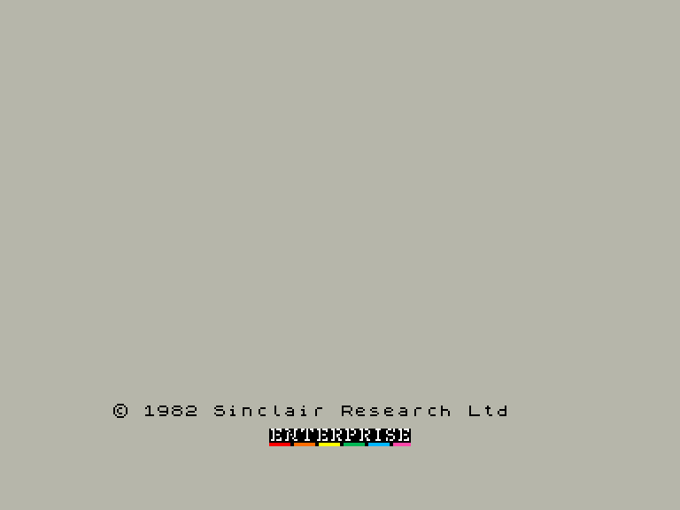
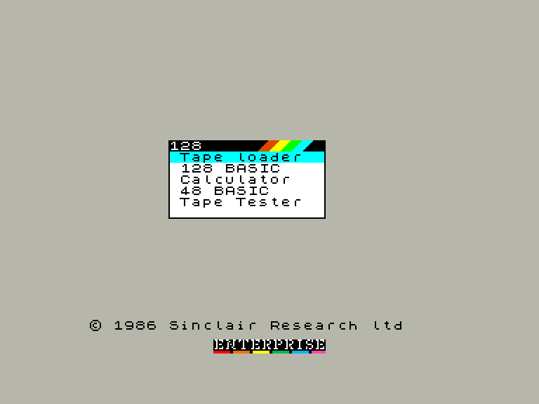
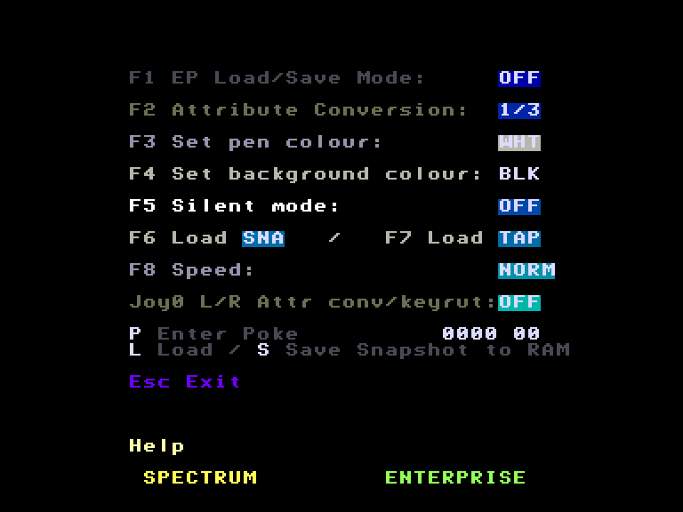
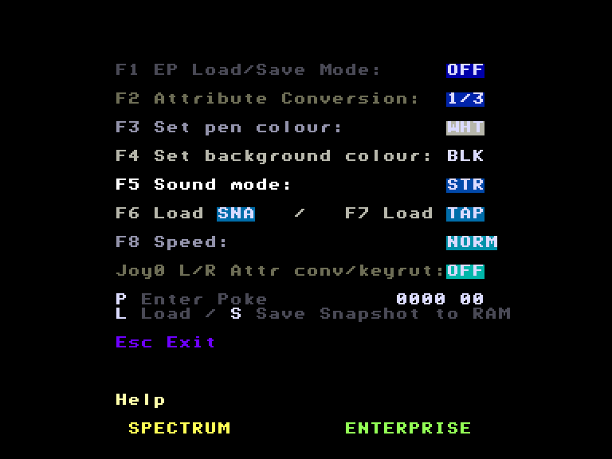

# SPEmu / SPEmu128

http://ep128.hu/Ep_Util/SPEmu.htm

Емулятор комп'ютерів **Sinclair ZX Spectrum 48/128**.

Автор: [Geco](../community/geco.md)

Підтримка форматів для завантаження:
 - аудіовхід (у форматі стандартного сигналу для ZX Spectrum) 
 - TAP-файл у стандартному форматі для ZX Spectrum який можна завантажувати з EXOS-сумісних накопичувачів.
 - SNA-файл у стандартному форматі для ZX Spectrum який можна завантажувати з EXOS-сумісних накопичувачів.
 - snapshot.snp снепшот власного формату який можна завантажувати з EXOS-сумісних накопичувачів.

Підтримка форматів для зберігання:
 - аудіовихід (у форматі стандартного сигналу для ZX Spectrum) 
 - TAP-файли для збереження інформації з програм які можна зберігати на EXOS-сумісних накопичувачах.
 - snapshot.snp снепшот власного формату який можна зберігати на EXOS-сумісних накопичувачах.

Емуляція аудіопристроїв:
 - біпер
 - генератор звуку AY (стерео або моно) (тільки у **SPEmu128**)

Емуляція пристроїв введення:

 - Cursor Joystick: [Internal Joystick](../sf-games/controllers.md)
 - Sinclair Joystick 1: [External Joystick 1](../sf-games/controllers.md)
 - Sinclair Joystick 2: [External Joystick 2](../sf-games/controllers.md)
 - Kempston Mouse: [EnterMice](../hardware/mouse-entermice.md) чи [BoxSoft Mouse](../hardware/mouse-boxsoft.md) (тільки у **SPEmu128**)

|                         SPEmu                          |                         SPEmu128                          |
|:------------------------------------------------------:|:---------------------------------------------------------:|
|  |  |
|    |    |

## Системні вимоги:

| SPEmu                                                                                                     | SPEmu128                                                                                                                                                                                                    |
|:--------------------------------------------------------------------------------------------------------- |:----------------------------------------------------------------------------------------------------------------------------------------------------------------------------------------------------------- |
| *Мінімальні системні вимоги:*  RAM: **128 KB** (**112 KB** для ROM-версії)                             | *Мінімальні системні вимоги:*  RAM: **240 KB** (**176 KB** для ROM-версії)                                                                                                                               |
| *Рекомендовані системні вимоги:*  RAM: **176 KB** (**160 KB** для ROM-версії)  [EXDOS](ss-exdos.md) | *Рекомендовані системні вимоги:*  RAM: **368 KB** (**304 KB** для ROM-версії)  [EXDOS](ss-exdos.md)  [EnterMice](../hardware/mouse-entermice.md) або [BoxSoft Mouse](../hardware/mouse-boxsoft.md) |

## Гарячі клавіши (на екрані емуляції):
`F1`: виклик головного меню емулятора  
`F3`: вихід з емулятора у IS-Basic (тільки ROM-версия)  
`F4`: вихід з емулятора у WP (тільки ROM-версия)  
`F8`: Reset емуляції ZX Spectrum  

## Головне меню та його гарячі клавіши
`F1`: увімкнути/вимкнути роботу з файлами у EXOS-форматі.
- **OFF** *(за замовчуванням)*: емулятор виконує операції з файлами у форматі Spectrum (використовуються аудіопорти "**IN** / **OUT**" Ентерпрайза)  
- **ON**: емулятор виконує операції з файлами у форматі EXOS. Наприклад, ви можете зберегти результат своєї роботи у програмі на диск у файл TAP (працює, якщо програма робить виклик стандартної підпрограми ROM ZX Spectrum).

`F2`: вибрати режим конвертації атрибутів кольорів екрану
- **1/3** *(за замовчуванням)*: кожне переривання проводиться конвертація атрибутів кольорів третини екрану. Оптимальний режим для швидкості процесора 4 МГц.
-  **1/1**:  кожне переривання проводиться конвертація атрибутів кольорів усього екрану. Рекомендований режим для швидкості процесора 6 МГц.
- **OFF**: конвертація атрибутів вимкнена (атрибути кольорів лишаються такими які були на момент вимкнення конвертації)
- **DEF**: двоколірний режим екрану з користувацькими кольорами

`F3`: вибір кольору INK (тільки для **DEF**ine режиму конвертації атрибутів)

`F4`: вибір кольору PAPER (тільки для **DEF**ine режиму конвертації атрибутів)

`F5` (у *SPEmu*): вимкнення звуку
- **OFF** *(за замовчуванням)*: звук є
- **ON**: звука немає

`F5` (у *SPEmu128*): налаштування звуку
- **STR** *(за замовчуванням)*: стереозвук - "стерео" AY міксується з звучанням біперу.
- **MON**: лівий канал - звук AY, правий - біпер
- **OFF**: звук вимкнено (точніше мінімальна гучність)

`F6`: завантажити SNA-файл у EXOS форматі.

`F7`: завантажити TAP-файл у EXOS форматі.

`F8`: швидкість емуляції
- **NORM**: Рекомендований режим для швидкості процесора 4МГц.
- **FAST**:
- **SLOW**: Рекомендований режим для швидкості процесора 6МГц.

`IntJoy ↔`: примусова конвертація атрибутів прив'язана до натискання клавіш (використовується якщо стандартний режим конвертації прив'язаного до переривань не працює)
- **OFF**: вимкнено
- **1**-**255**: конвертація атрибутів виконується кожне **n**-натискання клавіш. Малі значення можуть призвести до зниження швидкості емуляції.

`P`: ввести POKE

`L` (за наявності розширеної ОЗП): завантажити збережений у пам'яті стан емулятора

`S` (за наявності розширеної ОЗП): зберегти у пам'ять поточний стан емулятора

`W`: записати на EXOS-накопичувач поточний стан емулятора 

`R`: прочитати з EXOS-накопичувача збережений стан емулятора з файлу **snapshot.snp** (рекомендується попередньо завантажити гру звичайним шляхом, а потім завантажувати снепшот)

`IntJoy ↕`:  відобразити таблицю відповідності клавіш Спектрума до клавіатури Ентерпрайза.

`Esc`: повернутись до екрану емуляції.

Відповідність клавіш:

| **Spectrum**       | **Enterprise** |
| ------------------ | -------------- |
| CAPS SHIFT         | ⇧ Left SHIFT   |
| SYMBOL SHIFT       | ⇧ Right SHIFT  |
| CAPS SHIFT + SPACE | STOP           |
| CAPS SHIFT + 0     | ⌫ ERASE        |

## Швидкий старт

### Завантаження TAP-файлу у емулятор
1. Завантажити емулятор
2. Натиснути `F1` щоб відкрити головне меню емулятора.
3. Натиснути `F7` для вибору потрібного TAP-файлу.
4. Послідовно натиснути `J`, `RightShift`+`P`, `RightShift`+`P`, `Enter` (для введення команди `LOAD ""`) або натиснути `Enter` на пункті **Tape Loader**.
5. Дочекатись завантаження гри.

### Завантаження SNA-файлу у емулятор
1. Завантажити емулятор
2. Натиснути `F1` щоб відкрити головне меню емулятора.
3. Натиснути `F6` для вибору потрібного SNA-файлу.
4. Дочекатись завантаження гри.

### Завантаження програм з оригінального аудіоносія.
1. Завантажити емулятор.
2. Послідовно натиснути `J`, `RightShift`+`P`, `RightShift`+`P`, `Enter` (для введення команди `LOAD ""`) або натиснути `Enter` на пункті **Tape Loader**.  
3. Запустити програвання на касетному накопичувачі і дочекатись завантаження гри.

## Додаткова інформація

Перевага ROM-версії емулятора полягає у тому, що ПЗП ZX Spectrum не може бути пошкодженим програмами, які можуть здійснювати запис даних у область ПЗП.

Щоб запустити ROM-версію емулятора потрібно ввести `:SPEMU` або `:SP128` в залежності від версії емулятора.

При завантаженні TAP-файлу з аудіовходу, у головному меню буде зчитано лише назву файлу. Поставте програвач на паузу, і на екрані ZX Spectrum введіть `LOAD ""` чи виберіть пункт меню **Tape Loader**. Після чого програвання можна продовжити.

Якщо ви використовуєте касетний накопичувач з керованою паузою, то при завантаженні оригінальних касет для ZX Spectrum необхідно витягнути штекер **REM** чи **REMOTE** зі сторони накопичувача.

## Формат снапшоту snapshot.snp

Розмір файлу: 49179 байтів

**001Bh**-**1B1Bh**: екран у форматі SCR

## Інше

http://ep128.hu/Ep_Util/SPEmu.htm