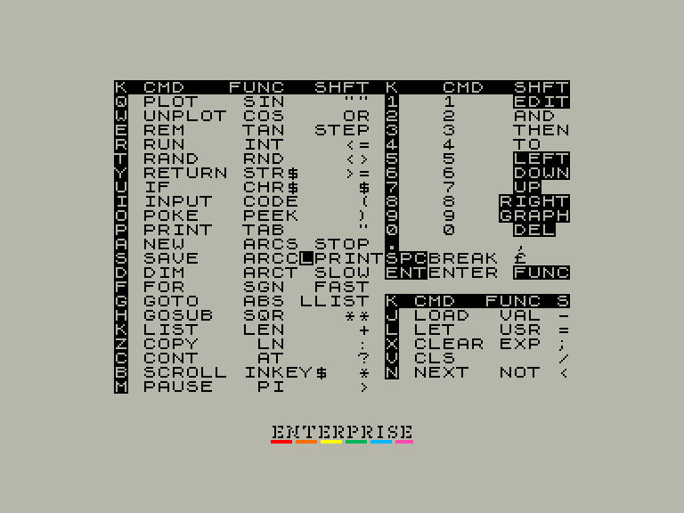
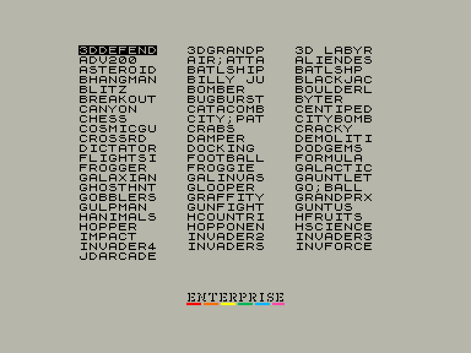

# ZX81Emu

http://ep128.hu/Ep_Util/ZX81_Emulator.htm

`F1`: Показати підказку по клавіатурним командам  
`F2`: Якщо в системі є наявний EXDOS, показує список перших 256 файлів (\*.p) з можливістю вибору для завантаження  
`F7`: Reset комп'ютера ZX81  

|                                                        |                                                    |     |
| ------------------------------------------------------ | -------------------------------------------------- | --- |
|  |  |     |