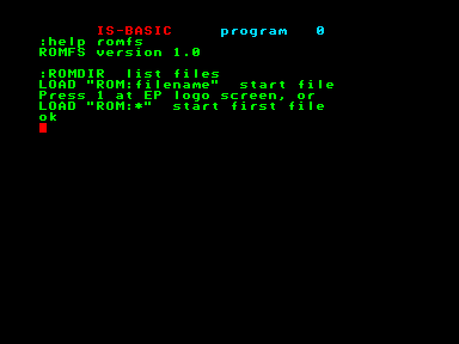
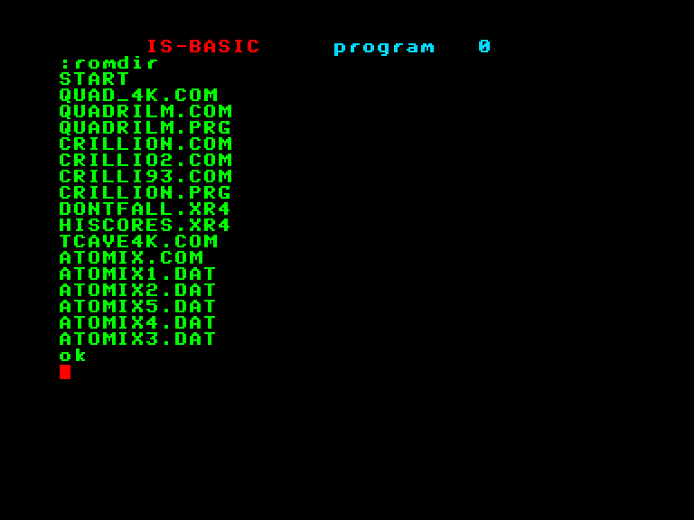

# ROMFS

## Загальний опис

 

Файлова система для розміщення файлів на ROM-пристроях (картріджах та подібних).

Додає в систему пристрій "[ROM:](../programming/system-info/exos-devices/romfs.md)".

Для завантаження файлів треба використовувати префікс `ROM:`, який додається до назви файлу. Наприклад в Бейсіку можна використовувати стандартну команду `load "rom:назва_файлу"`

Варіанти використання:

 - `rom:назва_файлу`: звернутись до конкретного файлу інтегрованого у ROM.
 - `rom:*`: завантажити перший файл на пристрої (в якості цього файлу можна використати розширення [File](sx-file.md) для подальшого зручного вибору файлів для завантаження) або натиснути **1** на початковому екрані з логотипом Enterprise.

Також додає в систему команду `:ROMDIR` якою можна вивести перелік файлів інтегрованих у ROM.

 

## Як створити ROM з потрібними файлами

