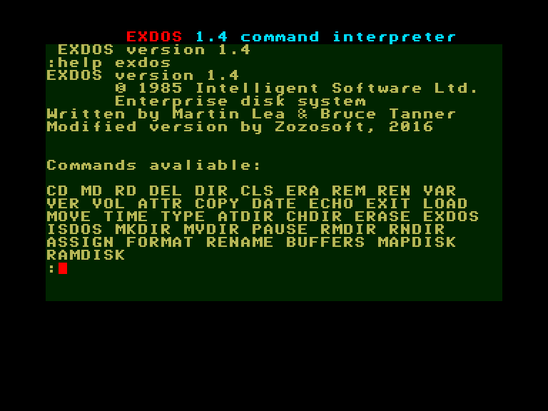

# EXDOS (Enterprise eXpandable Disk Operating System)

[Опис апаратної частини EXDOS](../hardware/hd-exdos.md)

----

# Документація

📔 [Офіційний посібник користувача EXDOS](../manuals/ss-exdos-manual-en.md) (англійською)

## Cпецифікація (попередня версія)

Документи відносяться до предрелізних версій продукту і тому деякі частини будуть відрізнятись від того що увійшло у фінальну версію.

[Contents](http://enterprise.iko.hu/technical/EXDOS_Enterprise-Disk-Software_contents.pdf)  
[EXDOS System overview](http://enterprise.iko.hu/technical/PER-1-1_EXDOS_System_Overview.pdf)  
[EXDOS DISKIO Specifications](http://enterprise.iko.hu/technical/PER-2-3_EXDOS_DISKIO_Specification.pdf)  
[EXDOS Unit Handler Specifications](http://enterprise.iko.hu/technical/PER-3-2_EXDOS_Unit_Handler_Specification.pdf)  
[DISKIO and UNITH implementation notes]()  
[EXDOS System Specifications](http://enterprise.iko.hu/technical/PER-5-2_EXDOS_System_Specification.pdf)  

# Посилання на зовнішні ресурси

[http://ep.homeserver.hu/Dokumentacio/Konyvek/EXDOS/EXDOSeng.htm](http://ep.homeserver.hu/Dokumentacio/Konyvek/EXDOS/EXDOSeng.htm)