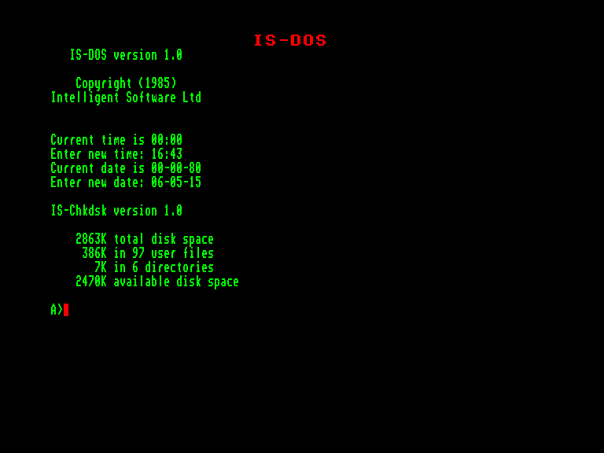
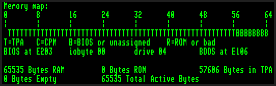
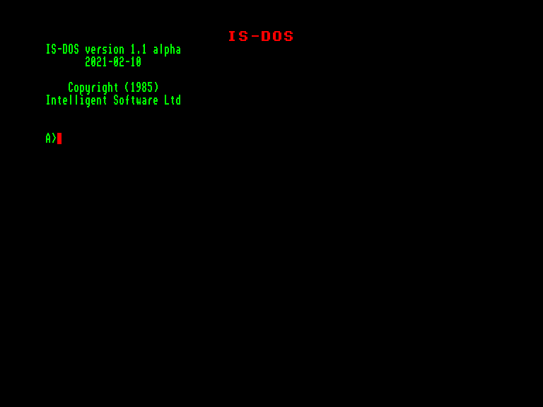
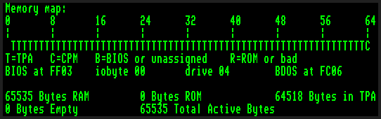

# IS-DOS

Розробник: [Intelligent Sofware Ltd](../companies/intelligent-sofware-ltd.md)  
Автори: [Bruce Tanner](../peoples/ec-uk/pers_bruce-tanner.md) (більша частина) та ще хтось.    
Рік: 1985  

> Max CP/M version: **2.2**  
> Емуляція терміналу: **VT52** (керуючі коди та escape-послідовності)   
> `VAR 90 ON` for Fast Video  

**IS-DOS** — це дискова операційна система, яка дозволяє Enterprise запускати більшість прикладних програм, розроблених для роботи під управлінням операційної системи CP/M-80 версії 2.2. Засоби пакетної обробки [EXDOS](ss-exdos.md) також розширено, а самі команди EXDOS можна виконувати безпосередньо з IS-DOS. Як і EXDOS, IS-DOS використовує файлову структуру MS-DOS, тому файли обох систем можуть зберігатися поруч на одному диску.

Будь-яка програма CP/M-80, яку планується запускати на Enterprise, повинна знаходитися на диску формату MS-DOS. Слід зазначити, що деякі програми «модифікують» CP/M під час інсталяції — запуск таких програм під IS-DOS неможливий.

# Документація

📔 [IS-DOS Manual](../manuals/ss-is-dos-manual-en.md)

📕 [Посібник користувача угорською](http://ep128.hu/Ep_Konyv/ISDOS.htm)

## Cпецифікація (попередня версія)

Документи відносяться до предрелізних версій продукту і тому деякі частини будуть відрізнятись від того що увійшло у фінальну версію.

[ISDOS System Specifications](http://enterprise.iko.hu/technical/PER-16-2_ISDOS_System_Specification.pdf)  

# Версії системи

## IS-DOS 1.0

 <i>Екран після запуску IS-DOS 1.0</i>

Офіційна версія розповсюджувалась на дискеті як завантажувальна. Але користувачі створили ROM-версію для зручнішого використання (яка відразу запускається у 80-колонковому режимі). 

 <i>Інформація о IS-DOS 1.0 з програми System Survey</i>

## IS-DOS 1.1a

 <i>Екран після запуску IS-DOS 1.1a</i>

У 2021 році [Джон Брендвуд](../peoples/pers_john-brandwood.md) дещо переробив оригінальну версію. 

Ось опис більшості змін:

Нова версія не додає жодних нових можливостей (MSX-DOS 2, ZCPR3, CP/M 3 тощо), але реорганізує спосіб роботи IS-DOS у пам'яті, щоб у майбутньому було простіше вносити подальші зміни.

Головна відмінність від IS-DOS 1.0 полягає в тому, що IS-DOS 1.1 тепер працює у виділеному сегменті, який вона сама собі виділяє під час запуску.

Це означає, що розмір TPA (області виконання програм), доступний для застосунків CP/M та IS-DOS, збільшився з 56 КБ до 63 КБ, що тепер дозволить запускати більше програм CP/M, такі як компілятор BDS C.

«Швидкий» відеодрайвер також було оптимізовано — він працює майже (але не зовсім! 😉) удвічі швидше, роблячи використання застосунків CP/M (та IS-DOS) значно приємнішим.

Компроміс полягає в тому, що «швидкий» відеодрайвер тепер підтримує лише 2 набори кольорів для тексту, але натомість він більше не зрізає крайній правий піксель у символів 'M' та 'W', що виглядає на екрані набагато краще.

Хоча файл IS-DOS.SYS тепер на 1 дисковий сектор коротший, ніж раніше (використовує 13 312 байтів замість 13 824 байтів), усередині програми є приблизно 2 КБ вільного місця для додавання нового коду чи функцій.

У цій версії IS-DOS 1.1-alpha від 10.02.2021 є помилка: регістр L містить некоректне значення для функцій MSX-DOS "Block Read" та "Get Time".

Також не працює функція автостарту.

 <i>Інформація о IS-DOS 1.1a з програми System Survey</i>

# Історія розробки

> [Брюс Таннер](../peoples/ec-uk/pers_bruce-tanner.md):  
> Наприкінці існування компанії [Intelligent Software](../companies/intelligent-sofware-ltd.md) / [Enterprise](../companies/enterprise-computers-ltd.md) [Роберт Медж](../peoples/ec-uk/pers_robert-madge.md) їздив до Японії, намагаючись продати IS-DOS консорціуму MSX як MSX-DOS 2, а також продати версію для процесора HD64180 із використанням його функцій пейджингу. Як ми тепер знаємо, з цього нічого не вийшло, а Microsoft поцупила функцію віднови файлів (undel). Проте для підтримки цієї поїздки було написано низку документів, включно з ідеями щодо майбутніх можливостей IS-DOS. 
> 
> Гадаю, основними фічами були змінні оточення, перенаправлення, конвеєри/пайпи (як це було в тогочасній MS-DOS) і... найголовніше... декілька одночасних областей TPA (із використанням пейджингу Enterprise або 64180) та кооперативна багатозадачність. Тобто можна було запустити WordStar в одній TPA, натиснути Alt+TAB чи щось подібне, щоб переключитися на іншу TPA й запустити щось інше.