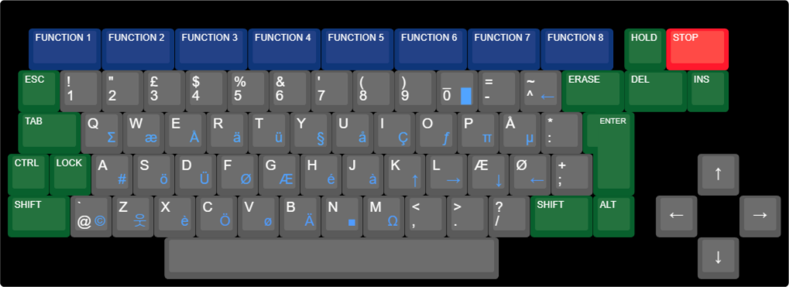
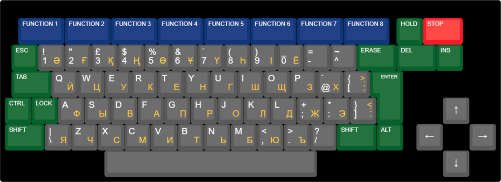
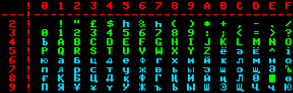

# Локалізації

Ентерпрайз підтримує можливість додавання локалізацій системи (мовних пакетів). Це дозволяє інтерфейсним повідомленням та текстам помилок відображатися іншими мовами. Крім того, шрифт та розкладка клавіатури теж може бути змінені. ПЗП із локалізацією за замовчуванням розташоване у картріджі з Бейсіком. В даний час в систему можна додати лише один мовний пакет, який складається зі стандартної англійської та однієї іншої. До того ж розкладка клавіатури жорстко прив'язана до конкретної локалізації (тобто ми не можемо мати одночасно англійський інтерфейс і німецьку розкладку клавіатури та навпаки).

Прошивка мовного пакету містить наступне:
 - системні команди перемикання локалізацій (наприклад: англійська ↔ німецька);
 - шрифт;
 - модифікований драйвер системного пристрою [KEYBOARD](../programming/system-info/exos-devices/keyboard.md), що дозволило змінити обробку клавіатури (розкладку клавіш);
 - модифікований драйвер системного пристрою [EDITOR](../programming/system-info/exos-devices/editor.md), щоб при використанні екранного редактору слова не розділялись при перенесенні на нову строку по доданим діакритичним символам);
 - розширення для Бейсіку для обробки помилок та виведення повідомлень на необхідній мові;
 - додаткові підпрограми для роботи з графічним екраном (VDUMP, VLOAD, VSAVE);
 - VBLANK у LPT робить більш "стандартним" (VSYNC буде коротшим): ця зміна зазвичай не дає помітного ефекту, але на деяких старих телевізорах зображення може бути стабільнішим. 

Пізніше, на основі німецького мовного пакету ентузіасти створили локалізації і для інших мов.

## BRD (німецька)

Офіційна локалізація що йшла з німецькими версіями комп'ютера. На її основі були зроблені інші мовні пакети.

Клавіатура: **QWERTZ** (з додатковими діакритичними символами)  

Таблиця символів на основі **ISO-646-DE**

## DAN (данська)

Напівофіційна локалізація створена локальним дистриб'ютером у Данії компанією **Semicap ApS**.

Клавіатура: **QWERTY** (з додатковими діакритичними символами)  

Таблиця символів на основі **ISO-646-DK**

## HUN

Клавіатура: **QWERTZ** (з додатковими діакритичними символами)  

## ESP (іспанська)

Неофіційна локалізація.

Клавіатура: **QWERTY** (з додатковими діакритичними символами)  

## CIRIL (кирилиця з казахськими діакритичними символами)

Напівофіційна локалізація створена угорською **'a' Studió** на замовлення **Enterprise Computers GmbH** у 1989 році. В ній використовувалась лише додаткова розкладка та шрифти — текст повідомлень не змінений.

> [!УВАГА]
> ⚠ Ця локалізація може бути не [EXOS-сумісною](exos/exos-compability.md), і тому не рекомендується для повсякденного користування.

Клавіатура: **QWERTY/ЙЦУКЕН**  

В режимі кирилиці:  
Norm - кирилиця мала  
Shift - кирилиця велика  
Alt - латинка велика  

Таблиця символів на основі дуже зміненої **KOI-7** (блакитним кольором позначено нові символи)

  