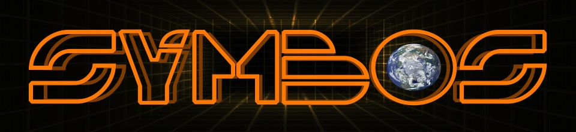
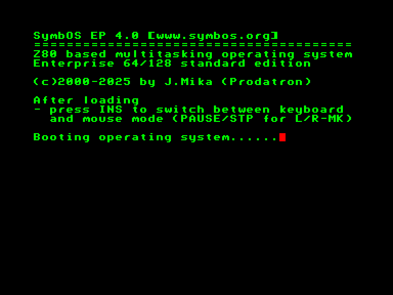
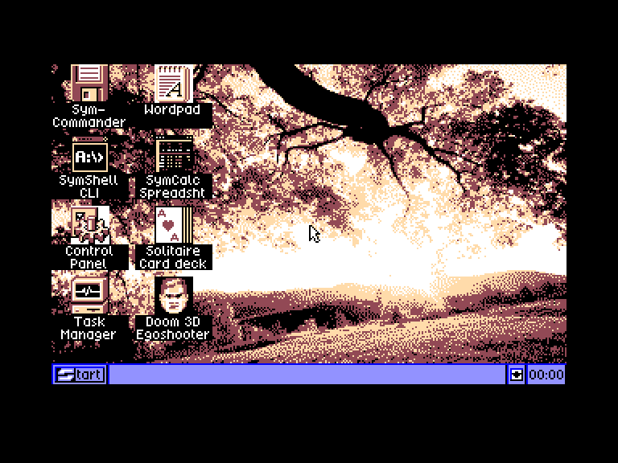
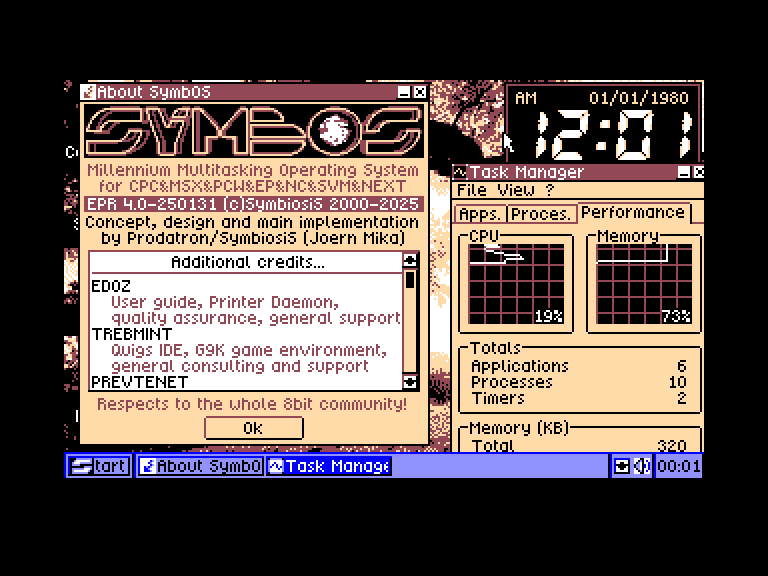
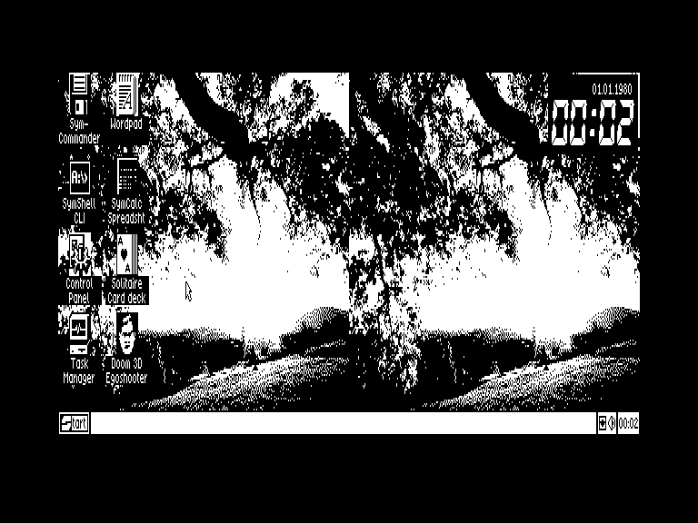

# SymbOS

Автор: [Jörn Prodaval](../peoples/community/prodatron.md)

**SYmbiosis Multitasking Based Operating System** (**SymbOS**) це багатозадачна операційна система 8-бітних комп'ютерів побудованих на процесорі Zilog Z80.

[Сайт проекту](http://www.symbos.org/download.htm)

 
 
 

**Мінімальні системні вимоги:**

 - RAM: 128 кБ  
 - [EXDOS](../hardware/hd-exdos.md) або [SYMBiFACE 3](../hardware/he-sf3.md) USB накопичувач

**Рекомендовані системні вимоги:**

 - RAM: 192 кБ або вище  
 - [EXDOS](../hardware/hd-exdos.md) або [SYMBiFACE 3](../hardware/he-sf3.md) USB накопичувач
 - Миша ([EnterMice](../hardware/hid/mouse-entermice.md) / [BoxSoft](../hardware/hid/mouse-boxsoft.md) / [SYMBiFACE 3](../hardware/he-sf3.md) USB mouse)