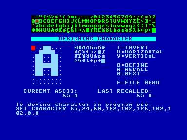

# CHR2012

Вміє завантажувати [FNT](fileformats/fmt_fnt-epfnt.md)-файли, редагувати та зберігати шрифти як у форматі програми BASIC так і у ті ж самі FNT-файли.

[Інформація](http://ep128.hu/Ep_Util/Util.htm)  
[Завантажити](http://ep128.hu/Ep_Util/Prg/Util.rar)  