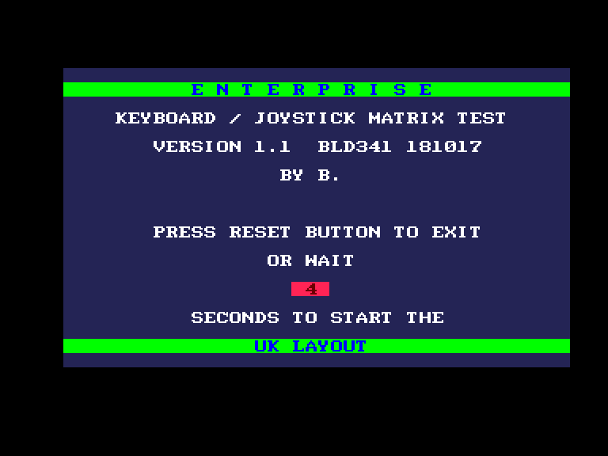
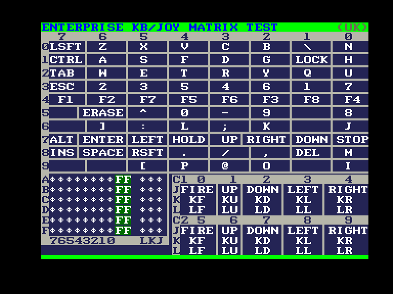
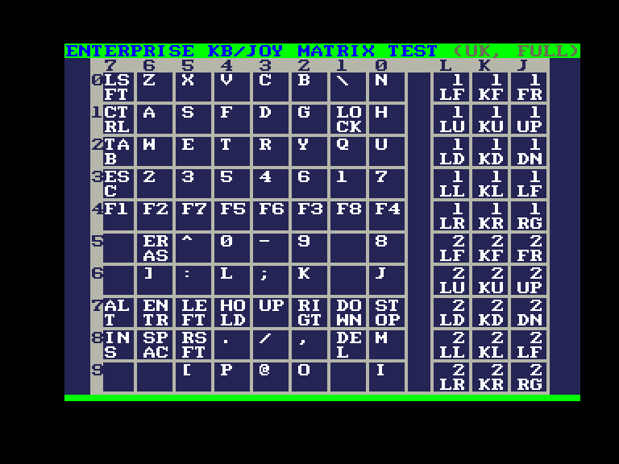

# HIDTest

Системні вимоги: **Enterprise 64/128**

Програма для тестування клавіатури та джойстиків. Має підтримку як англійської так і німецької розкладки клавіатури.

Тест може відображатись у трьох режимах:

 - англійська розкладка клавіатури;
 - німецька розкладка клавіатури;
 - англійська розкладка (матричний вигляд)

(ви можете переключатися між ними, натискаючи одноразово кнопку **Reset**)

Кожен екран працює по єдиному алгоритму і відрізняється лише їхнє відображення.

  
Початковий екран

  
Екран з англійською розкладкою клавіатури (німецька аналогічна і відрізняється тільки символами)

  
Матричний вигляд 

Клавіатура й джойстики Enterprise організовані за матрицею 11 стовпців × 10 рядків. Фон активної клавіші або напрямку джойстиків зміниться на червоний. Якщо клавіша не активна, але хоча б один раз була натиснута, відповідний фон буде зеленим. Вибір рядків у комп’ютері є 4-бітним, що означає 16 різних варіантів, але використовуються лише перші 10. Решта 6 рядків також опитуються, тому, якщо буде реалізовано якесь розширення, результат з’явиться на першому та другому екранах.

[Домашня сторінка](https://web.archive.org/web/20240324032430/http://bsz.amigaspirit.hu/hidtest/index_en.html)  
▶ [Easy Load&Play](https://t.me/EP128k_Load_n_Play/131) *(Telegram-канал Vibrant Waves)*    

